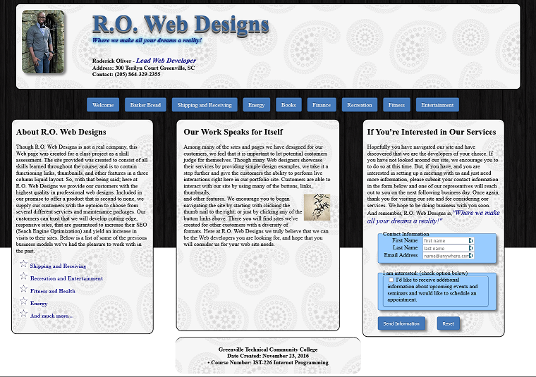

Portfolio
=========

Programming Projects
--------------------

*For access to my private project repositories, please [email me](mailto:example@csustudent.net?subject=GitHub%20Access) with the subject line, GitHub Access.

---
### [Project 1 Title | CSCI 301](project1)

---
### [Project 2 Title | CSCI 315](project2)

---
### [Project 3 Title | CSCI 325](project3)

---
### [Applied Networking Final Project & Lab | CSCI 332](project4)

---
### [CPT Senior Group Project | CSCI 275](project5)

---
### [Internet Programming Final Project | CSCI 226](project6)

---

Ethics Papers
-------------

### [Edward Snowden: *Treasonous Traidor or Hero of the American People?*](pdf/Edward_Snowden.pdf)

-   Class: *CSCI 405 Principles of Cybersecurity*  
-   Grade: *A*

### [Intellectual Property: *Should Programmers have the right to protect the algorithms they develop?*](pdf/Intellectual_Property.pdf)

-   Class: *CSCI 301 Survey of Scripting Languages* 
-   Grade: *B+*

### [Ad Blockers: *From a Christian perspective, Is using Ad Blockers morally wrong?*](pdf/Ad_Blockers.pdf)

-   Class: *CSCI 235 Procedural Programming*
-   Grade: *C+*

---

Presentations
-------------

### [Ethical Hacking: *Fighting Fire with Fire*](pdf/Ethical_Hacking.pdf)

- Class: *CSCI 405 Principles of Cybersecurity* 
- Grade: *A*

### [Estee Lauder Data Breach: *The forgotten Records*](pdf/Estee_Lauder_Breach_2020.pdf)

- Class: *CSCI 301 Survey of Scripting Languages* 
- Grade: *B+*

### [Information Laws & Standards Infographic](pdf/Information_Laws_&_Standards_Infograph.pdf)

- Class: *CSCI 352 Cyber Defense* 
- Grade: *Placeholder*

---

Page template forked from <a href="https://github.com/csu-cs/csci-portfolio">CSU-CS</a>

<!-- Remove above link if you don't want to attributive -->
