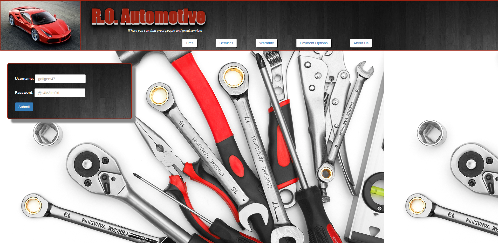
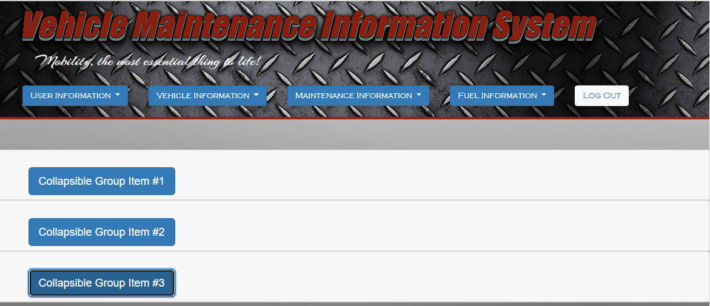
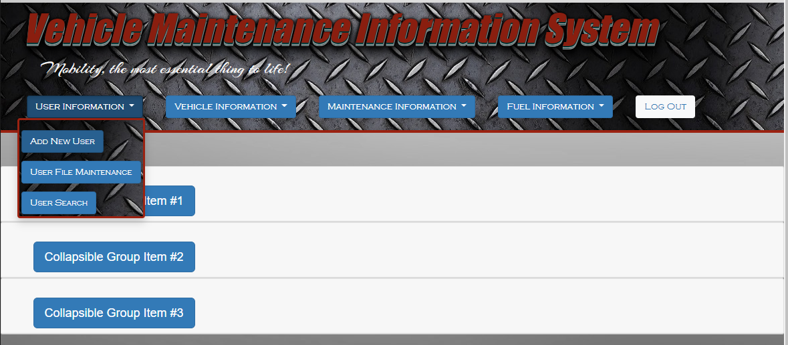
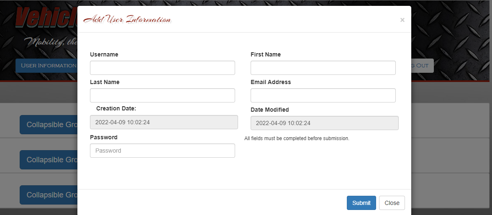
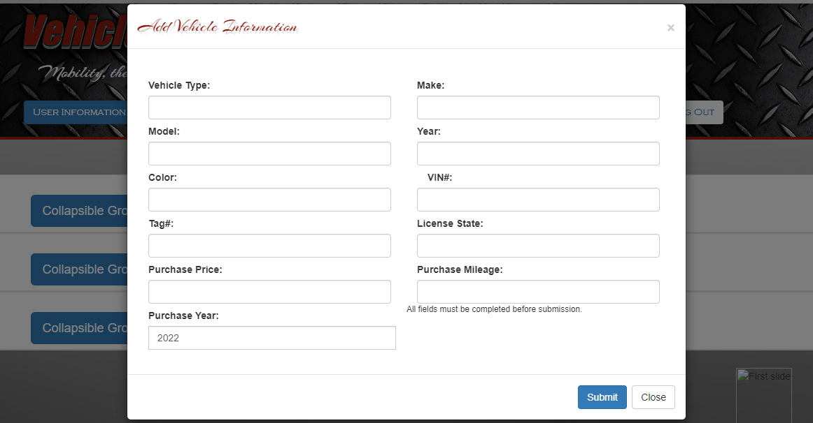
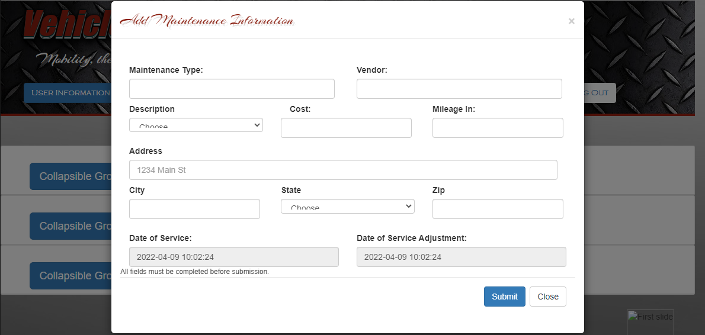
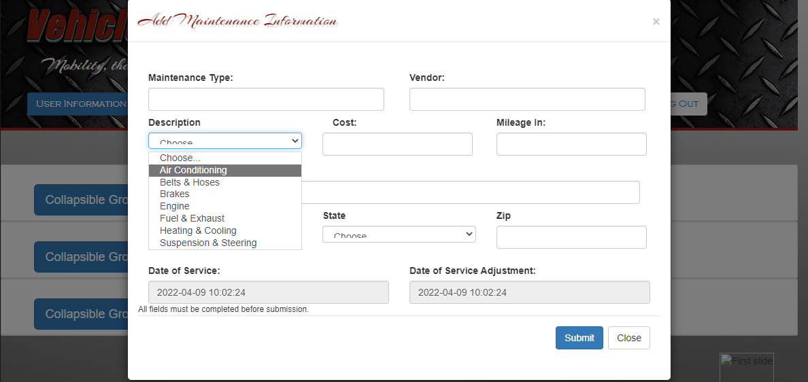
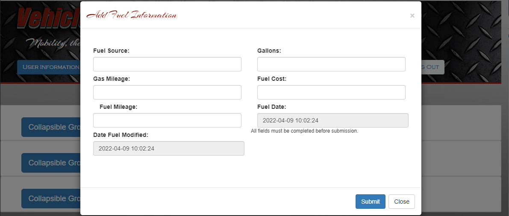

[Back to Portfolio](./)

Personal Porject in Progress
===============

-   **Language(s):** *HTML5, PHP* 

## Project description

This project is an extension of a class project from my PHP & MySQL class. The purpose of the project is to develop an online vehicle maintence tracker that allow the user to catalog each vehicle't make, model, year, and option, the types of maintenance needed and the types of maintenance done over the years. It is to also to keep a record of the type of fuel used it's cost at the time and it's consumption, to help determine if there are performance issues due to the change is fuel consumptions.

## How to run the program

How to compile (if applicable) and run the project.

```bash
The user user will need to setup a database for MySQL to be able to input the table containing the vehicle information.

<?php

require('input.php');
ob_start();
//require('admin.php');
?>

<!DOCTYPE html>
<html lang="en-us">
<head>

<title>Vehicle Log</title>

    <title>Vehicle Maintenance Log</title>

    <meta name="viewport" content="device-width, intial-scale=1"/>
    <link rel="stylesheet" href="https://maxcdn.bootstrapcdn.com/bootstrap/4.0.0/css/bootstrap.min.css" integrity="sha384-Gn5384xqQ1aoWXA+058RXPxPg6fy4IWvTNh0E263XmFcJlSAwiGgFAW/dAiS6JXm" crossorigin="anonymous">

    <script src="https://ajax.googleapis.com/ajax/libs/jquery/3.2.1/jquery.min.js"></script>
    <script src="https://maxcdn.bootstrapcdn.com/bootstrap/3.3.7/js/bootstrap.min.js"></script>
    <script src="https://cdnjs.cloudflare.com/ajax/libs/jquery-validate/1.17.0/jquery.validate.js"></script>
    <script src="https://cdnjs.cloudflare.com/ajax/libs/jquery-validate/1.17.0/additional-methods.js"></script>

    <link href='http://fonts.googleapis.com/css?family=Arizonia' rel='stylesheet' type='text/css'>
    <link rel="stylesheet" href="vehicle_log.css">

    <!-- Include Required Prerequisites -->
    <script type="text/javascript" src="//cdn.jsdelivr.net/jquery/1/jquery.min.js"></script>
    <script type="text/javascript" src="//cdn.jsdelivr.net/momentjs/latest/moment.min.js"></script>
    <link rel="stylesheet" type="text/css" href="//cdn.jsdelivr.net/bootstrap/3/css/bootstrap.css" />

    <!-- Include Date Range Picker -->
    <script type="text/javascript" src="//cdn.jsdelivr.net/bootstrap.daterangepicker/2/daterangepicker.js"></script>
    <link rel="stylesheet" type="text/css" href="//cdn.jsdelivr.net/bootstrap.daterangepicker/2/daterangepicker.css" />

</head>

<body>
     <header>
             <h1 id="headstyle" class="hit-the-floor">Vehicle Maintenance Information System</h1>
             <h5 id="h5-style">Mobility, the most essential thing to life!</h5>
             <div class="btn-toolbar">
                 <div id="head-toolbar" class="dropdown btn-group">
                     <button type="button" class="btn btn-primary dropdown-toggle" data-toggle="dropdown" aria-haspopup="true" aria-expanded="false">
                         User Information
                     </button>
                     <div id="head-menu" class="dropdown-menu" aria-labelledby="dropdownMenuButton">
                         <button id="frmpad" type="button" class="btn btn-primary" data-toggle="modal" data-target="#btnAdd" data-whatever="addNewUser">Add New User</button><br>
                         <a id="frmpad" type="button" class="btn btn-primary btn-md" href="user_update.php">User File Maintenance</a><br>
                         <a id="frmpad" type="button" class="btn btn-primary" href="search_records.php">User Search</a>
                     </div>
                 </div>
                 <div id="head-toolbar" class="dropdown btn-group">
                     <button type="button" class="btn btn-primary dropdown-toggle" data-toggle="dropdown" aria-haspopup="true" aria-expanded="false">
                         Vehicle Information
                     </button>
                     <div id="head-menu" class="dropdown-menu" aria-labelledby="dropdownMenuButton">
                         <button id="frmpad" type="button" class="btn btn-primary" data-toggle="modal" data-target="#btnVehicle" data-whatever="addVehicle">Add New Vehicle</button></a><br>
                         <a  id="frmpad" type="button" class="btn btn-primary btn-md" href="vehicle_update.php">Vehicle File Maintenance</a><br>
                         <a id="frmpad" type="button" class="btn btn-primary" href="search_records.php">Vehicle Search</a>
                     </div>
                 </div>
                 <div id="head-toolbar" class="dropdown btn-group">
                     <button  type="button" class="btn btn-primary dropdown-toggle" data-toggle="dropdown" aria-haspopup="true" aria-expanded="false">
                         Maintenance Information
                     </button>
                     <div id="head-menu" class="dropdown-menu" aria-labelledby="dropdownMenuButton">
                         <button id="frmpad" type="button" class="btn btn-primary" data-toggle="modal" data-target="#btnMain" data-whatever="addVehicleMain">Add Vehicle Maintenance</button><br>
                         <a id="frmpad" type="button" class="btn btn-primary btn-md" href="maintenance_update.php">Update Maintenance Records</a><br>
                         <a id="frmpad" type="button" class="btn btn-primary btn-md" href="maintenance_type_update.php">Update Service Records</a><br>
                         <a id="frmpad" type="button" class="btn btn-primary" href="search_records.php">Search Maintenance/Service</a>
                     </div>
                 </div>
                 <div id="head-toolbar" class="dropdown btn-group">
                     <button type="button" class="btn btn-primary dropdown-toggle" data-toggle="dropdown" aria-haspopup="true" aria-expanded="false">
                         Fuel Information
                     </button>
                     <div id="head-menu" class="dropdown-menu" aria-labelledby="dropdownMenuButton">
                         <button id="frmpad" type="button" class="btn btn-primary" data-toggle="modal" data-target="#btnFuel" data-whatever="addFuel">Add Fuel Information</button><br>
                         <a id="frmpad" type="button" class="btn btn-primary btn-md" href="fuel_update.php">Update Fuel Records</a><br>
                         <a id="frmpad" type="button" class="btn btn-primary" href="search_records.php">Search Fuel Records</a>
                     </div>
                 </div>
                 <div id="head-toolbar" class="dropdown btn-group">
                     <button type="button" class="btn btn-light">
                         <a href="logout.php">Log Out</a>
                     </button>
                 </div>
             </div>
     </header>
<main>
    <!-- Add/Edit User Modal Dialog -->
    <div id="btnAdd" class="modal fade" tabindex="-1" role="dialog">
        <div class="modal-dialog modal-lg" role="document">
            <div class="modal-content">
                <div class="modal-header">
                    <h4 id="h4-style" class="modal-title">Add User Information</h4>
                    <button type="button" class="close" data-dismiss="modal">&times;</button>
                </div>
                <div class="modal-body">
                    <h3></h3>
                    <form id="userForm" class="form-group" method="post">
                        <div class="form-group-row">
                            <div class="col-md-6">
                                <label for="">Username</label>
                                <input type="text" name="user_name" value="" class="form-control" maxlength="32" required>
                            </div>
                        </div>
                        <div class="form-group-row">
                            <div class="col-md-6">
                                <label for="">First Name</label>
                                <input type="text"  name="first_name" value="" class="form-control" maxlength="15" pattern="^[A-Z][a-z]*$" required>
                            </div>
                            <div class="col-md-6">
                                <label for="">Last Name</label>
                                <input type="text"  name="last_name" value="" class="form-control" maxlength="15" pattern="^[A-Z][a-z]*$" required>
                            </div>
                        </div>
                        <div class="form-group-row">
                            <div class="col-md-6">
                                <label for="">Email Address</label>
                                <input type="text" class="form-control" name="email">
                                <!-- auto populates using javascript/jQuery.ajax -->
                            </div>
                            <div class="col-md-6">
                                <label for="creation_date-input" class="col-md-6 col-form-label">Creation Date:</label>
                                <input class="form-control" type="datetime"  name="date_created" value="<?php echo $date_created;?>" disabled>
                                <!-- auto populates using javascript/jQuery.ajax -->
                            </div>
                        </div>
                        <div class="form-group">
                            <div class="col-md-6">
                                <label for="editEmail">Date Modified</label>
                                <input type="datetime"  name="date_modified" value="<?php echo $date_modified;?>" class="form-control" disabled>
                            </div>
                        </div>
                        <div class="form-group">
                            <div class="col-md-6">
                                <label for="">Password</label>
                                <input type="text" name="user_password"  class="form-control" placeholder="Password" maxlength="32">
                            </div>
                            <div class="col-md-6">
                                <label for="editEmail"></label>
                                <input type="datetime"  name="date_lastlogin" value="<?php echo $date_lastlogin;?>" class="form-control" hidden>
                            </div>
                        </div>
                    </form>
                    <small>All fields must be completed before submission.</small>
                </div>
                <br><br>
                <br>
                <div class="modal-footer">
                    <input form="editUserForm" type="submit" class="btn btn-primary" data-target="btnVehicle" id="submit-edits-user" name="submit" value="Submit" data-toggle="modal" data-target="btnVehicle data-dismiss="modal">
                    <button type="button" class="btn btn-default" data-dismiss="modal" >Close</button>
                </div>
            </div>
        </div>
    </div>
    <!-- End Add/Edit User Modal Dialog -->

    <!-- Add/Edit Vehicle Modal Dialog -->
    <div id="btnVehicle" class="modal fade" tabindex="-1" role="dialog">
        <div class="modal-dialog modal-lg" role="document">
            <div class="modal-content">
                <div class="modal-header">
                    <h4 id="h4-style" class="modal-title">Add Vehicle Information</h4>
                    <button type="button" class="close" data-dismiss="modal">&times;</button>
                </div>
                <div class="modal-body">
                    <h3></h3>
                    <form id="vehicleForm" class="form-group" action="index.php" method="post">
                        <div class="form-group-row">
                            <div class="col-md-6">
                                <label for="">Vehicle Type:</label>
                                <input type="text" name="vehicle_type"  class="form-control" maxlength="32" required>
                            </div>
                        </div>
                        <div class="form-group-row">
                            <div class="col-md-6">
                                <label for="">Make:</label>
                                <input type="text" name="vehicle_make"  class="form-control" maxlength="32" required>
                            </div>
                        </div>
                        <div class="form-group-row">
                            <div class="col-md-6">
                                <label for="">Model:</label>
                                <input type="text"  name="vehicle_model"  class="form-control">
                            </div>
                            <div class="col-md-6">
                                <label for="">Year:</label>
                                <input type="text"  name="vehicle_year"  class="form-control">
                            </div>
                        </div>
                        <div class="form-group-row">
                            <div class="col-md-6">
                                <label for="">Color:</label>
                                <input type="text" class="form-control" name="vehicle_color"></input>
                                <!-- auto populates using javascript/jQuery.ajax -->
                            </div>
                            <div class="col-md-6">
                                <label for="" class="col-md-6">VIN#:</label>
                                <input class="form-control" type="text"  name="vehicle_VIN">
                                <!-- auto populates using javascript/jQuery.ajax -->
                            </div>
                        </div>
                        <div class="form-group-row">
                            <div class="col-md-6">
                                <label for="editEmail">Tag#:</label>
                                <input type="text"  name="vehicle_license_tag" class="form-control">
                            </div>
                            <div class="col-md-6">
                                <label for="editEmail">License State:</label>
                                <input type="text"  name="vehicle_license_state" class="form-control">
                            </div>
                        </div>
                        <div class="form-group">
                            <div class="col-md-6">
                                <label for="">Purchase Price:</label>
                                <input type="text" name="vehicle_purchase_price"  class="form-control">
                            </div>
                        </div>
                        <div class="form-group">
                            <div class="col-md-6">
                                <label for="">Purchase Mileage:</label>
                                <input type="text" name="vehicle_purchase_mileage"  class="form-control">
                            </div>
                            <div class="col-md-6">
                               <label>Purchase Year:</label>
                                    <div class='input-group'>
                                        <input  type="text" name="vehicle_year_purchased" value="<?php echo $year; ?>" class="form-control" />
                                    </div>
                            </div>
                        </div>
                    </form>
                    <small>All fields must be completed before submission.</small>
                </div>
                <br>
                <div class="modal-footer">
                    <input form="editUserForm" type="submit" class="btn btn-primary"  data-target="btnMain" id="submit-edits-vehicle" name="submit" value="Submit">
                    <button type="button" class="btn btn-default" data-dismiss="modal">Close</button>
                </div>
            </div>
        </div>
    </div>
    <!-- End Add/Edit Vehicle Modal Dialog -->

    <!-- Add/Edit Maintenance Modal Dialog -->
    <div id="btnMain" class="modal fade" tabindex="-1" role="dialog">
        <div class="modal-dialog modal-lg" role="document">
            <div class="modal-content">
                <div class="modal-header">
                    <h4 id="h4-style" class="modal-title">Add Maintenance Information</h4>
                    <button type="button" class="close" data-dismiss="modal">&times;</button>
                </div>
                <div class="modal-body">
                    <h3></h3>
                    <form id="mainForm" class="form-group" action="index.php" method="post">
                        <div class="form-group-row">
                            <div class="col-md-6">
                                <label for="">Maintenance Type:</label>
                                <input type="text"  name="maintenance_type"  class="form-control">
                            </div>

                            <div class="col-md-6">
                                <label for="">Vendor:</label>
                                <input type="text"  name="maintenance_vendor"  class="form-control">
                            </div>

                            <div class="form-group col-md-4">
                                <label for="">Description</label>
                                <select id="" name="maintenance_description" class="form-control">
                                    <option selected>Choose...</option>
                                    <option>Air Conditioning</option>
                                    <option>Belts & Hoses</option>
                                    <option>Brakes</option>
                                    <option>Engine</option>
                                    <option>Fuel & Exhaust</option>
                                    <option>Heating & Cooling</option>
                                    <option>Suspension & Steering</option>
                                </select>
                            </div>
                            <div class="col-md-4">
                                <label for="creation_date-input" class="col-md-6">Cost:</label>
                                <input class="form-control" type="text"  name="maintenance_cost">
                                <!-- auto populates using javascript/jQuery.ajax -->
                            </div>
                            <div class="col-md-4">
                                <label for="editEmail">Mileage In:</label>
                                <input type="text"  name="maintenance_mileage" class="form-control">
                            </div>

                        <div class="form-group">
                            <div class="col-md-12">
                                <label for="inputAddress">Address</label>
                                <input type="text" class="form-control" id="inputAddress" name="maintenance_vendor_address" placeholder="1234 Main St">
                            </div>
                            <div class="form-group col-md-4">
                                <label for="inputCity">City</label>
                                <input type="text" class="form-control" id="inputCity">
                            </div>
                            <div class="form-group col-md-4">
                                <label for="inputState">State</label>
                                <select id="inputState" class="form-control">
                                    <option selected>Choose...</option>
                                    <option>...</option>
                                </select>
                            </div>
                            <div class="form-group col-md-4">
                                <label for="inputZip">Zip</label>
                                <input type="text" class="form-control" id="inputZip">
                            </div>
                        </div>
                        <div class="form-group-row">
                            <div class="col-md-6">
                                <label for="editEmail">Date of Service:</label>
                                <input type="datetime"  name="maintenance_date" value="<?php echo $maintenance_date;?>" class="form-control" disabled>
                            </div>
                        </div>
                        <div class="form-group">
                            <div class="col-md-6">
                                <label for="">Date of Service Adjustment:</label>
                                <input type="datetime"  name="maintenance_date_modified" value="<?php echo $maintenance_date_modified;?>" class="form-control" disabled>
                            </div>
                        </div>
                </div>
                        <br>
                    <small>All fields must be completed before submission.</small>
                        <br>
                <div class="modal-footer">
                    <input form="editUserForm" type="submit" class="btn btn-primary" data-target="btnFuel" id="submit-edits-maint" name="submit" value="Submit">
                    <button type="button" class="btn btn-default" data-dismiss="modal">Close</button>
                </div>
                </form>
                </div>
            </div>
        </div>
    </div>
    <!-- End Add/Edit Maintenance Modal Dialog -->

    <!-- Add/Edit Fuel Modal Dialog -->
    <div id="btnFuel" class="modal fade" tabindex="-1" role="dialog">
        <div class="modal-dialog modal-lg" role="document">
            <div class="modal-content">
                <div class="modal-header">
                    <h4 id="h4-style" class="modal-title">Add Fuel Information</h4>
                    <button type="button" class="close" data-dismiss="modal">&times;</button>
                </div>
                <div class="modal-body">
                    <h3></h3>
                    <form id="fuelForm" class="form-group" action="index.php" method="post">
                        <div class="form-group-row">
                            <div class="col-md-6">
                                <label for="">Fuel Source:</label>
                                <input type="text" name="suel_source"  class="form-control" maxlength="32">
                            </div>
                        </div>
                        <div class="form-group-row">
                            <div class="col-md-6">
                                <label for="">Gallons:</label>
                                <input type="text"  name="fuel_gallons"  class="form-control">
                            </div>
                            <div class="col-md-6">
                                <label for="">Gas Mileage:</label>
                                <input type="text"  name="fuel_mileage"  class="form-control">
                            </div>
                        </div>
                        <div class="form-group-row">
                            <div class="col-md-6">
                                <label for="">Fuel Cost:</label>
                                <input type="text" class="form-control" name="fuel_cost">
                                <!-- auto populates using javascript/jQuery.ajax -->
                                </input>
                            </div>
                            <div class="col-md-6">
                                <label for="creation_date-input" class="col-md-6">Fuel Mileage:</label>
                                <input class="form-control" type="text"  name="fuel_mileage">
                                <!-- auto populates using javascript/jQuery.ajax -->
                            </div>
                        </div>
                        <div class="form-group-row">
                            <div class="col-md-6">
                                <label for="editEmail">Fuel Date:</label>
                                <input type="datetime"  name="fuel_date" value="<?php echo $fuel_date;?>" class="form-control" disabled>
                            </div>
                            <div class="col-md-6">
                                <label for="editEmail">Date Fuel Modified:</label>
                                <input type="datetime"  name="fuel_date_modified" value="<?php echo $fuel_date_modified;?>" class="form-control" disabled>
                            </div>
                        </div>
                    </form>
                    <small>All fields must be completed before submission.</small>
                </div>
                <br><br>
                <br>
                <div class="modal-footer">
                    <input form="editUserForm" type="submit" class="btn btn-primary" id="submit-edits-fuel" name="submit" value="Submit">
                    <button type="button" class="btn btn-default" data-dismiss="modal">Close</button>
                </div>
            </div>
        </div>
    </div>
    <!-- End Add/Edit Fuel Modal Dialog -->

    <container>
        <div id="container">
            <div class="card">
                <div class="card-header" id="headingOne">
                    <h2 class="mb-0">
                        <button class="btn btn-primary btn-lg collapsed" data-toggle="collapse" data-target="#collapseOne" aria-expanded="true" aria-controls="collapseOne">
                            Collapsible Group Item #1
                        </button>
                    </h2>
                </div>
                <div id="collapseOne" class="collapse" aria-labelledby="headingOne" data-parent="#accordion">
                    <div id="content" class="card-body">
                        Anim pariatur cliche reprehenderit, enim eiusmod high life accusamus terry richardson ad squid. 3 wolf moon officia aute, non cupidatat skateboard dolor brunch. Food truck quinoa nesciunt laborum eiusmod. Brunch 3 wolf moon tempor, sunt aliqua put a bird on it squid single-origin coffee nulla assumenda shoreditch et. Nihil anim keffiyeh helvetica, craft beer labore wes anderson cred nesciunt sapiente ea proident. Ad vegan excepteur butcher vice lomo. Leggings occaecat craft beer farm-to-table, raw denim aesthetic synth nesciunt you probably haven't heard of them accusamus labore sustainable VHS.
                    </div>
                </div>
            </div>
            <div class="card">
                <div class="card-header" id="headingTwo">
                    <h2 class="mb-0">
                        <button class="btn btn-primary btn-lg collapsed" data-toggle="collapse" data-target="#collapseTwo" aria-expanded="false" aria-controls="collapseTwo">
                            Collapsible Group Item #2
                        </button>
                    </h2>
                </div>
                <div id="collapseTwo" class="collapse" aria-labelledby="headingTwo" data-parent="#accordion">
                    <div id="content" class="card-body">
                        Anim pariatur cliche reprehenderit, enim eiusmod high life accusamus terry richardson ad squid. 3 wolf moon officia aute, non cupidatat skateboard dolor brunch. Food truck quinoa nesciunt laborum eiusmod. Brunch 3 wolf moon tempor, sunt aliqua put a bird on it squid single-origin coffee nulla assumenda shoreditch et. Nihil anim keffiyeh helvetica, craft beer labore wes anderson cred nesciunt sapiente ea proident. Ad vegan excepteur butcher vice lomo. Leggings occaecat craft beer farm-to-table, raw denim aesthetic synth nesciunt you probably haven't heard of them accusamus labore sustainable VHS.
                    </div>
                </div>
            </div>
            <div class="card">
                <div class="card-header" id="headingThree">
                    <h2 class="mb-0">
                        <button class="btn btn-primary btn-lg collapsed" data-toggle="collapse" data-target="#collapseThree" aria-expanded="false" aria-controls="collapseThree">
                            Collapsible Group Item #3
                        </button>
                    </h2>
                </div>
                <div id="collapseThree" class="collapse" aria-labelledby="headingThree" data-parent="#accordion">
                    <div id="content" class="card-body">
                        Anim pariatur cliche reprehenderit, enim eiusmod high life accusamus terry richardson ad squid. 3 wolf moon officia aute, non cupidatat skateboard dolor brunch. Food truck quinoa nesciunt laborum eiusmod. Brunch 3 wolf moon tempor, sunt aliqua put a bird on it squid single-origin coffee nulla assumenda shoreditch et. Nihil anim keffiyeh helvetica, craft beer labore wes anderson cred nesciunt sapiente ea proident. Ad vegan excepteur butcher vice lomo. Leggings occaecat craft beer farm-to-table, raw denim aesthetic synth nesciunt you probably haven't heard of them accusamus labore sustainable VHS.
                    </div>
                </div>
            </div>
        </div>
    </container>
    <aside>
        <div id="carouselExampleIndicators" class="carousel slide" data-ride="carousel">
            <ol class="carousel-indicators">
                <li data-target="#carouselExampleIndicators" data-slide-to="0" class="active"></li>
                <li data-target="#carouselExampleIndicators" data-slide-to="1"></li>
                <li data-target="#carouselExampleIndicators" data-slide-to="2"></li>
            </ol>
            <div class="carousel-inner">
                <div class="carousel-item active">
                    
                </div>
                <div class="carousel-item">
                    
                </div>
                <div class="carousel-item">
                    
                </div>
            </div>
            <a class="carousel-control-prev" href="#carouselExampleIndicators" role="button" data-slide="prev">
                <span class="carousel-control-prev-icon" aria-hidden="true"></span>
                <span class="sr-only">Previous</span>
            </a>
            <a class="carousel-control-next" href="#carouselExampleIndicators" role="button" data-slide="next">
                <span class="carousel-control-next-icon" aria-hidden="true"></span>
                <span class="sr-only">Next</span>
            </a>
        </div>
    </aside>
</main>

<footer>
<p></p>
</footer>

<script>

    $("#submit-edits-fuel").click(function () {
        $("#fuelForm").submit()
    })
    $("#submit-edits-maint").click(function () {
        $("#mainForm").submit()
    })
    $("#submit-edits-vehicle").click(function () {
        $("#vehicleForm").submit()
    })
    $("#submit-edits-user").click(function () {
        $("#userForm").submit()
    })


    $('#btn').on('show.bs.modal', function (event) {
        var button = $(event.relatedTarget); // Button that triggered the modal
       // var recipient = button.data('whatever'); // Extract info from data-* attributes
        // If necessary, you could initiate an AJAX request here (and then do the updating in a callback).
        // Update the modal's content. We'll use jQuery here, but you could use a data binding library or other methods instead.
        //var modal = $(this);
       // modal.find('.modal-title').text('New message to ' + recipient);
       // modal.find('.modal-body input').val(recipient)
    });


</script>

</body>
</html>
```

## UI Design

The application allows the user to login into the webiste with a unique username and password to acces the maintenance dashboard. The dashboard will provide the user with an interface that allows them to choose to add an additional user to the account, add a vehicle, the type of maintenance, the type of fuel and its cost and consumption, and the ability to update the user and vehicle information. The application is to also provide important information in the drop-down in the body of the page, such as recent recalls, common trouble codes, and important reminds and key maintenance tips, such as *how to prepare you vehicle for the winter*.

The screenshots below will provide a visual representation of a few functions. (see Fig 1), the website login page, is the first screen that the user sees when they navigate to the page. The page is simple for the fact that it is application expected to be updated according user needs. The second example is the user interface that allows the users to select from several options in the nav bar, the first being button for adding a new user (see Fig 2). The remaining examples are the models used to update the users, vehciles, and feuel information. Unfortunately the database is not attached at this moment and cannot display the table for the records in the database. This documentation will be updated later with screeshots of those examples. (see Figs 3 - Fig 8).

  
Fig 1. The Login screen

  
Fig 2. Example user logged into the site.

  
Fig 3. Example of selecting the *User Informatoin and Add User* buttons.

  
Fig 4. Example of selecting the *Add User* button and the model form.

  
Fig 5. Example of selecting the *Add Vehicle Information* button and the model form.

  
Fig 6. Example of selecting the *Vehicle Maintenance* button and the model form.

  
Fig 7. Example of selecting the *Vehicle Maintenance* button and the maintenance type selection.

  
Fig 8. Example of selecting the *Fuel Information* button and the model form.

[Back to Portfolio](./)
