[Back to Portfolio](./)

Website with Linked Pages, File Server transfer, Database management, & Online store.
===============

-   **Class:** *Applied Networking*
-   **Grade:** *B*
-   **Language(s):** *HTML, CSS, PHP, MySQL*

## Project description

Lorem ipsum dolor sit amet, consectetur adipiscing elit, sed do eiusmod tempor incididunt ut labore et dolore magna aliqua. Ut enim ad minim veniam, quis nostrud exercitation ullamco laboris nisi ut aliquip ex ea commodo consequat. Duis aute irure dolor in reprehenderit in voluptate velit esse cillum dolore eu fugiat nulla pariatur. Excepteur sint occaecat cupidatat non proident, sunt in culpa qui officia deserunt mollit anim id est laborum.

## How to compile and run the program

How to compile (if applicable) and run the project.

```bash
cd ./project
python setup.py
```

If the programming language does not require compilation, the update the heading to be “How to run the program.” If your application is deployed on a remote service, including instructions on how to deploy it.

## UI Design

Almost every program requires user interaction, even command-line programs. Include in this section the tasks the user can complete and what the program does. You don't need to include how it works here; that information may go in the project description or in an additional section, depending on its significance.

Lorem ipsum dolor sit amet (see Fig 1), consectetur adipiscing elit, sed do eiusmod tempor incididunt ut labore et dolore magna aliqua. Ut enim ad minim veniam, quis nostrud exercitation ullamco laboris nisi ut aliquip ex ea commodo consequat (see Fig 2). Duis aute irure dolor in reprehenderit in voluptate velit esse cillum dolore eu fugiat nulla pariatur. Excepteur sint occaecat cupidatat non proident, sunt in culpa qui officia deserunt mollit anim id est laborum (see Fig 3).

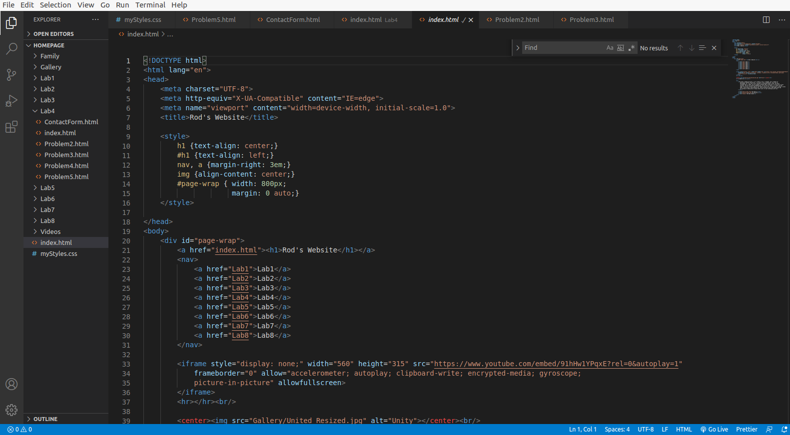  
Fig 1. Example of HTML Code and structure

  
Fig 2. Example of image hotspot.

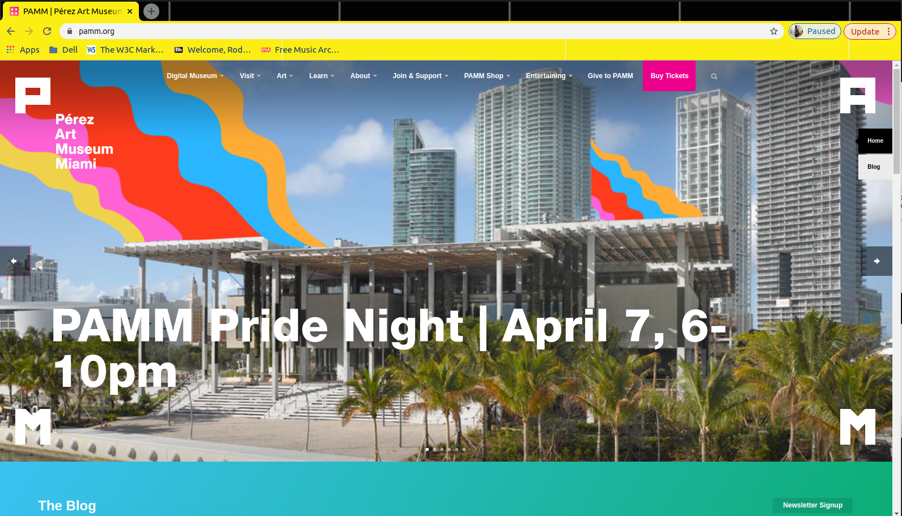  
Fig 3. Website page load from image hotspot.

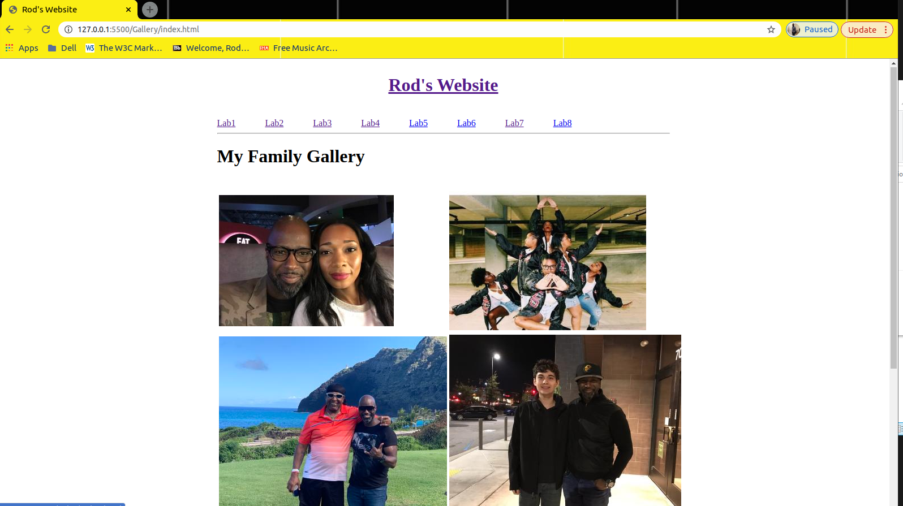  
Fig 4. Example of photo gallery page.

  
Fig 5. Example of embedded video.

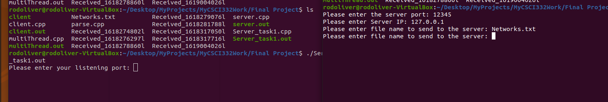  
Fig 6. Example of running the server and the client files in linux.

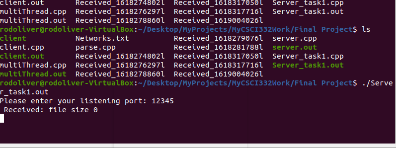  
Fig 7. Example of the server and the client transfer results.

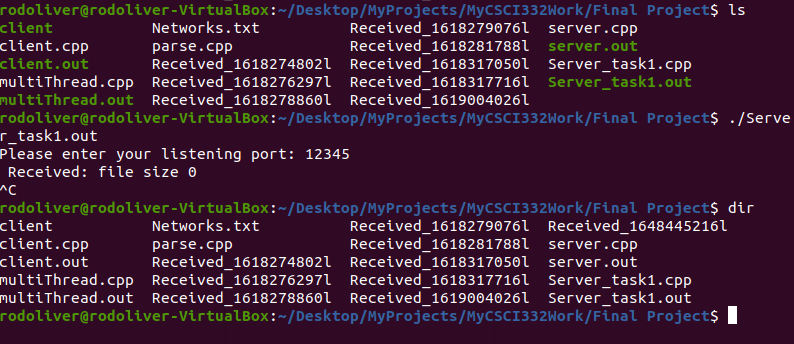  
Fig 8. Example of the server and the client received file update.

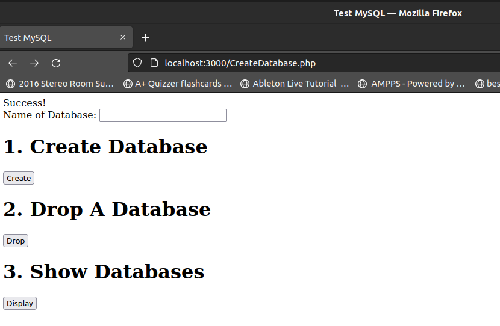  
Fig 9. Example of the database create, load, and show buttons connected to MySQL.

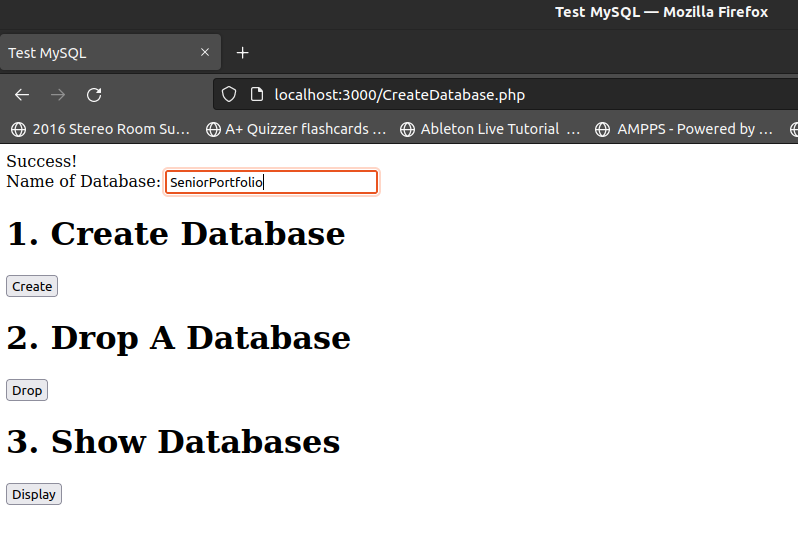  
Fig 10. Example of adding a database.

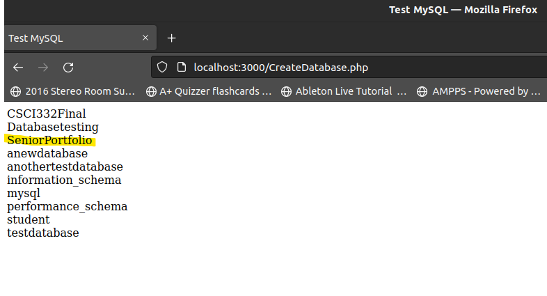  
Fig 11. Example of showing the added database.

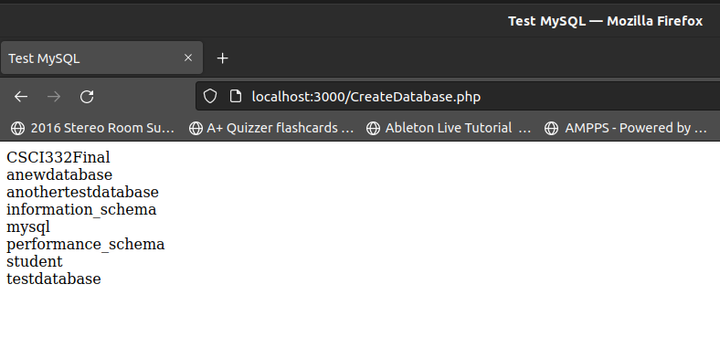  
Fig 12. Example of dropping the database.

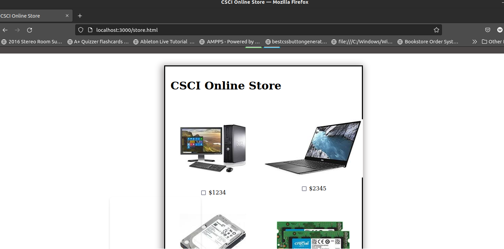  
Fig 13. Example of online store checkout page.

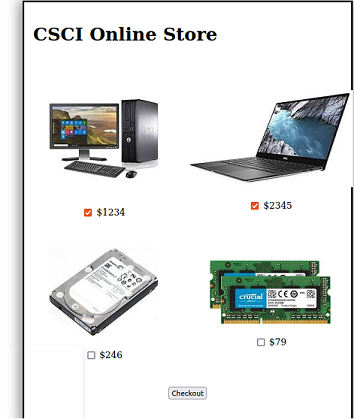  
Fig 14. Example of online store selection.

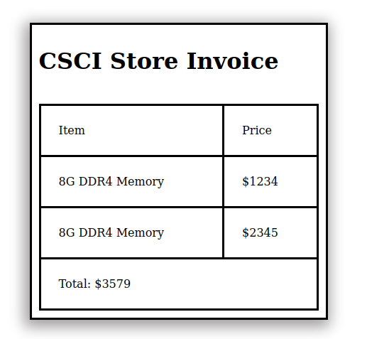  
Fig 15. Example of online store selection list of invoiced items.


## 3. Additional Considerations

Sed ut perspiciatis unde omnis iste natus error sit voluptatem accusantium doloremque laudantium, totam rem aperiam, eaque ipsa quae ab illo inventore veritatis et quasi architecto beatae vitae dicta sunt explicabo. 

For more details see [GitHub Flavored Markdown](https://guides.github.com/features/mastering-markdown/).

[Back to Portfolio](./)
