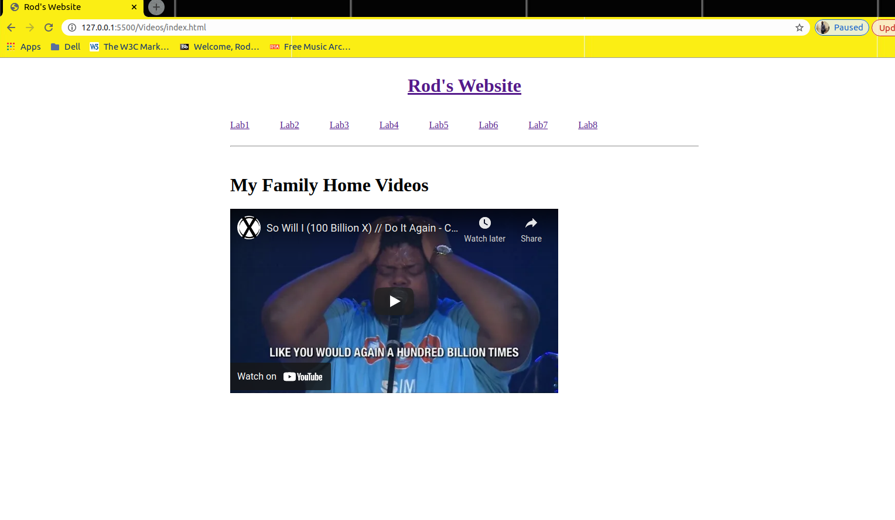

[Back to Portfolio](./)

*Linked Pages, File Server transfer*, *Database Management*, & *Online store*.
===============

-   **Class:** *Applied Networking*
-   **Grade:** *B*
-   **Language(s):** *HTML, CSS, PHP, MySQL*

## Project description

This particular project is a collection of semester long assignments, conssisting of the us eo of "VirtualBox, Visual Studio Code, and MySQL*. The project provided students the needed skills to create functional website using HTML, CSS, and PHP. The project also consist of creating a server & client application using the terminal in Ubuntu. 

## How to run the program

How to compile (if applicable) and run the project.

```bash
In order to run the command for the server application, the user will need to navigate to the server client files in their directors and runn the from the command line and typing in the below commands, each from different terminals, and press enter. Examplse can be found in the screenshots below:

./[client filename] in terminal 1

./[server filename] in terminal 2
```

```bash
Server Code:

#include <iostream>
#include <sys/socket.h>
#include <netinet/in.h>
#include <string.h>
#include <arpa/inet.h>
#include <unistd.h>

using namespace std;

int main()
{
    int udpSocket, size;
    char buffer[1000];
    struct sockaddr_in ServerAddr, ClientAddr;
    char *ClientIP;

    udpSocket = socket(PF_INET, SOCK_DGRAM, 0);
    ServerAddr.sin_family = AF_INET;
    cout << "Please enter a listening port: ";
    cin >> buffer;
    ServerAddr.sin_port = htons(atoi(buffer));
    memset(ServerAddr.sin_zero, '\0', sizeof(ServerAddr.sin_zero));
    socklen_t addr_size = sizeof ClientAddr;
    bind(udpSocket, (struct  sockaddr *)&ServerAddr, sizeof(ServerAddr));
    do
    {
        /* data */

      size = recvfrom(udpSocket, buffer, 1000, 0, (struct sockaddr *)&ClientAddr, &addr_size);
        buffer[size] = '\0';
        ClientIP = inet_ntoa(ClientAddr.sin_addr);
        cout << ClientIP << " says: " << buffer << endl;
    } while (strcmp (buffer, "Quit!") != 0);
    close(udpSocket);
    return 0;
}

```

```bash
Client Code:

#include <iostream>
#include <sys/socket.h>
#include <netinet/in.h>
#include <string.h>
#include <arpa/inet.h>
#include <unistd.h>

using namespace std;

int main()
{
    int clientSocket, nByte;
    char buffer[1000];
    struct sockaddr_in ServerAddr;
    socklen_t addr_size;

    clientSocket = socket(PF_INET, SOCK_DGRAM, 0);
    ServerAddr.sin_family = AF_INET;
    cout << "Please enter the server port: ";
    cin.getline(buffer, 9, '\n');
    ServerAddr.sin_port = htons(atoi(buffer));
    cout << "Please enter Server IP: ";
    cin.getline(buffer, 16, '\n');
    ServerAddr.sin_addr.s_addr = inet_addr(buffer);
    memset(ServerAddr.sin_zero, '\0', sizeof(ServerAddr.sin_zero));
    addr_size = sizeof ServerAddr;
    do
    {
        /* data */
        cout << "Type a sentence to send to the server: ";
        cin.getline(buffer, 1000, '\n');
        nByte = strlen(buffer) + 1;
        sendto(clientSocket, buffer, nByte, 0, (struct  sockaddr *)&ServerAddr, addr_size);
    } while (strcmp (buffer, "Quit!") != 0);
    close(clientSocket);
    return 0;
}

```

```bash
Datatabase Management Tool PHP Code:

<!DOCTYPE html>
<html lang="en">
<head>
    <meta charset="UTF-8">
    <meta http-equiv="X-UA-Compatible" content="IE=edge">
    <meta name="viewport" content="width=device-width, initial-scale=1.0">
    <title>Create Table</title>
</head>
<body>
<?php
            $servername = "localhost";
            $username = "root";
            $password = "your database password here!";
            $database = "CSCI332Final";
           
            $conn = new mysqli($servername, $username, $password, $database);
            $create_sql = "create database if not exists " . $_POST['database'];
            $drop_sql = "drop database if exists " . $_POST['database'];
            $display_sql = "show databases";
            $sql = "create table orders (SID Int(6) UNSIGNED AUTO_INCREMENT PRIMARY KEY,
            CustomerName VARCHAR(30) NOT NULL, 
            MovieName VARCHAR(30) NOT NULL, 
            NumOfTickets INT, 
            TicketType int, 
            PriceOfTicket int)";

            if ($conn->query($sql) == TRUE) {
                echo "Success!";
            }
            else {
                echo "Error creating database:" . $conn->error;
            }
            $conn->close();
    ?>

</body>
</html>

```

```bash
Movie Kiosk PHP Code:

<!DOCTYPE html>
<html lang="en">
<head>
    <meta charset="UTF-8">
    <meta http-equiv="X-UA-Compatible" content="IE=edge">
    <meta name="viewport" content="width=device-width, initial-scale=1.0">
    <title>Insert Into Table</title>
    <link rel="stylesheet" href="styles.css">
</head>
<body>
<?php
        if (isset($_POST['submit']))
        {
            $servername = "localhost";
            $username = "root";
            $password = "BlackOlive11!";
            $database = "CSCI332Final";
            $conn = new mysqli($servername, $username, $password, $database);
            $sql = "INSERT INTO orders (CustomerName, MovieName, NumOfTickets, TicketType, PriceOfTicket)
            values ('" . $_POST['CustomerName'] . "','" . $_POST['MovieName'] . "','" . 
            $_POST['NumbOfTickets'] . "','" . $_POST['TicktetType'] . "','" . $_POST['PriceOfTicktet'] . "')";
            echo $sql;
            

            if ($conn->query($sql) == TRUE) {
                echo "Success!"; "<br/>";
            }
            else {
                echo "Error creating database:" . $conn->error;
            }
            $conn->close();
        }
    ?>
    <h1 id="h1" >CSU Movie Kiosk</h1><br/>
    <hr></hr>
    <table>
        <th>Ticket Price
            <tr id="one">
                <td>Adult</td>
                <td>Child</td>
                <td>Senior</td>
            </tr>
            <tr>
                <td>$12</td>
                <td>$4</td>
                <td>$8</td>
            </tr>
            </tr>
        </th>
    </table><br/>
    <div>
        <form action="<?=$_SERVER['PHP_SELF'] ?>" method="post">

            Name:  <input type="text" name="CustomerName"/><br/>
            <br/>
            Choose a movie:<br/>
            <input type="radio" name="Spiderman" value="Spiderman" checked/>
            <label for="Spiderman">Spiderman</label><br/>
            <input type="radio" name="Superman" value="Superman" checked/>
            <label for="Superman">Superman</label><br/>
            <input type="radio" name="Runaway Child" value="Runaway Child" checked/>
            <label for="Runaway Child">Runaway Child</label><br/>
            <input type="radio" name="Jungle Baby" value="Jungle Baby" checked/>
            <label for="Jungle Baby">Jungle Baby</label><br/>
            <br/r>
            Adult:  <input type="text" name="NumOfTickets"/> tickets<br/><br/>
            Child:  <input type="text" name="NumOfTickets"/> tickets<br/><br/>
            Senior: <input type="text" name="NumOfTickets"/> tickets<br/><br/>
            <input type="submit" name="Submit" value="submit">

        </form>
    </div>
</body>
</html>

```


If the programming language does not require compilation, the update the heading to be “How to run the program.” If your application is deployed on a remote service, including instructions on how to deploy it.

## UI Design

The UI design for the class portfolio is a simple compilation of the work we've done ove the semeter. The site required that an Apache local server be setup and configured or use with our code. This required the use of Visual Studio Code to design the interface pages and the linkages from one page the the other. The allows for the user to be able to navigate between pages using the links and buttons used in the navigation bar. The second part of the project inclued the building of an onlione shopping cart and a tax calculator, which uses PHP with HTML. In conjunction with building the online shopping cart's use of PHP, the use of PHP to create the databse management tool, uses MySQL for the construction and management of the databased created or removed by the tool. Lastly, the Ubuntu command line terminal is used to perform a simple file tranfer. The screenshot below provives an example of how it works.

To provide a context for the way the code is constructed for the HTML application a screenshot has been provided (see Fig 1), that exemplies the how application handles the linked pages, as well as their design use of an internal and external cascading style sheets. The next few images describe how the site flows and the different pages and functions added as the portfolio progressed (see Fig 2 - 5). In the next few images the displays the file navigation for the simple file transfer and the running of the client/server commands used (see Fig 6 - 8). The following screenshot provide examples of how the database management tools works along with online shopping cart. The user is able to create a database using MySQL and are query the database for the added databases and can remove them if needed. The online shopping cart allows for a user to select from a list of items to be added to a cart and then calculates the quantity and the cost of the items selected. (see Fig 9 - 14)

  
Fig 1. Example of HTML Code and structure

  
Fig 2. Example of image hotspot.

  
Fig 3. Website page load from image hotspot.

  
Fig 4. Example of photo gallery page.

  
Fig 5. Example of embedded video.

  
Fig 6. Example of running the server and the client files in linux.

  
Fig 7. Example of the server and the client transfer results.

  
Fig 8. Example of the server and the client received file update.

  
Fig 9. Example of the database create, load, and show buttons connected to MySQL.

  
Fig 10. Example of adding a database.

  
Fig 11. Example of showing the added database.

  
Fig 12. Example of dropping the database.

  
Fig 13. Example of online store checkout page.

  
Fig 14. Example of online store selection.

  
Fig 15. Example of online store selection list of invoiced items.

  
Fig 15. Example of movie kiosk.


[Back to Portfolio](./)
