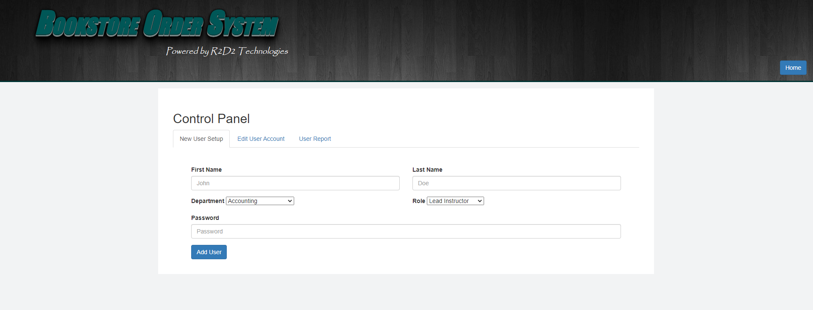
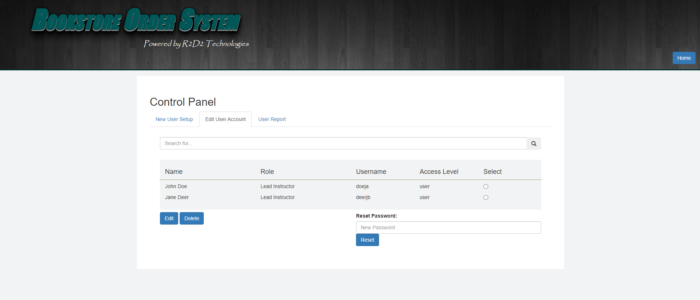
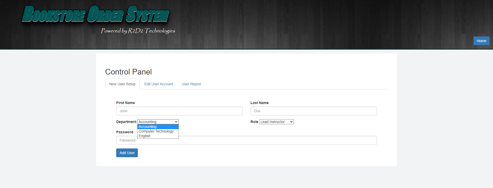
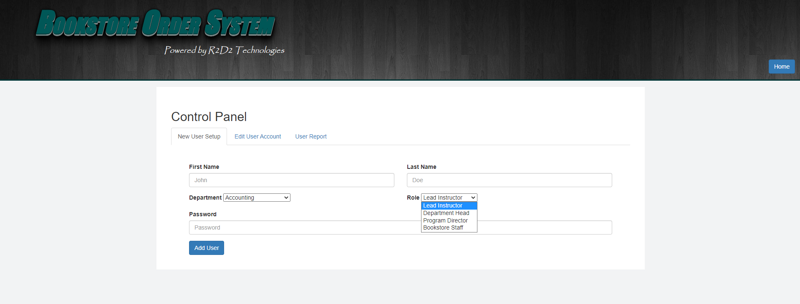
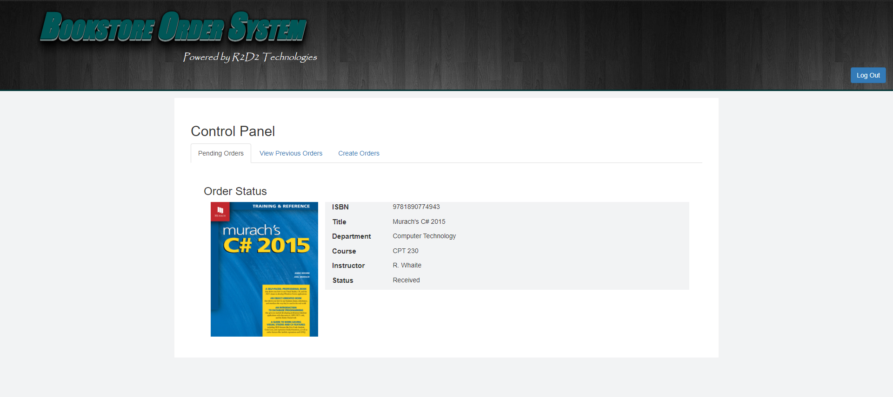
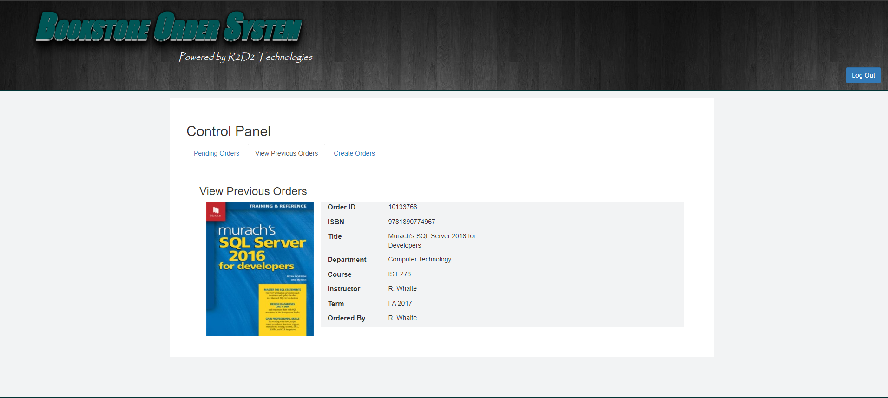
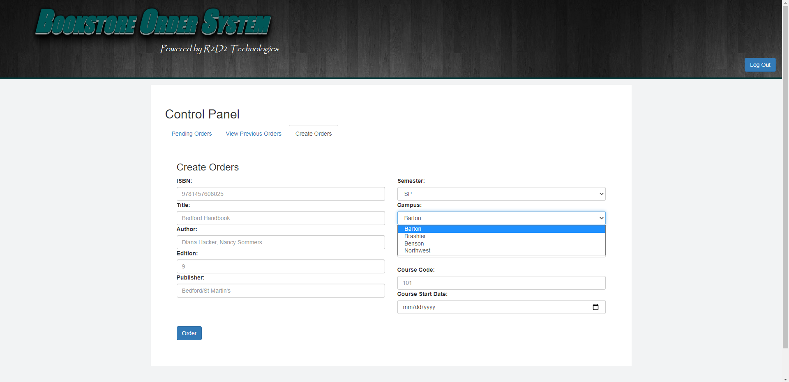
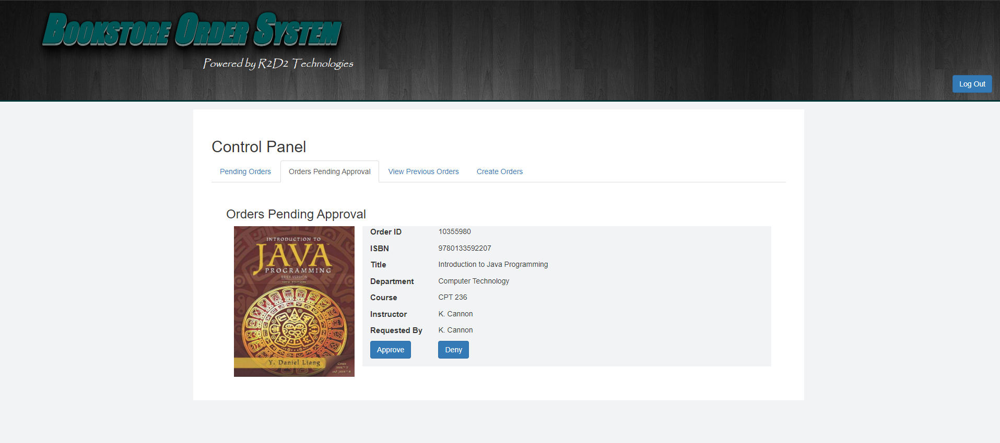
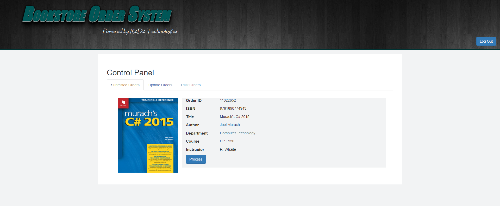
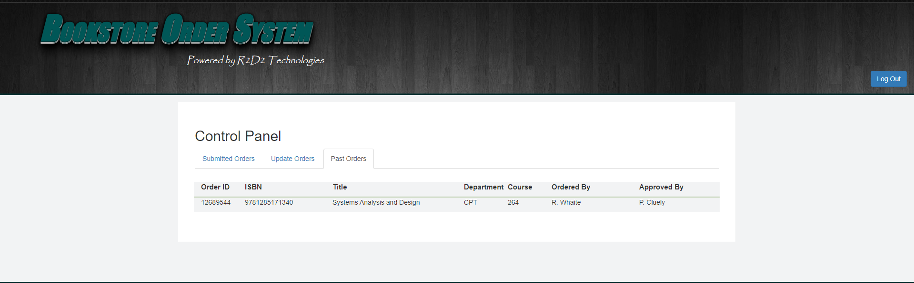

[Back to Portfolio](./)

Online Bookstore Final Project
===============

-   **Class:** *CSCI 275 CPT Senior Project* 
-   **Grade:** *A* 
-   **Language(s):** *HTML, PHP, JavaScript, JQuery, CSS* 
-   **Authors:** *David Slama, Ray Hill, Danial Greer, Roderick Oliver*
-   **Project Leader:** *Roderick Oliver*

## Project description

Lorem ipsum dolor sit amet, consectetur adipiscing elit, sed do eiusmod tempor incididunt ut labore et dolore magna aliqua. Ut enim ad minim veniam, quis nostrud exercitation ullamco laboris nisi ut aliquip ex ea commodo consequat. Duis aute irure dolor in reprehenderit in voluptate velit esse cillum dolore eu fugiat nulla pariatur. Excepteur sint occaecat cupidatat non proident, sunt in culpa qui officia deserunt mollit anim id est laborum.

## How to run the program:

Code Design Structure (will to setup on webserver) and to run the project.

```bash
<!DOCTYPE html>
<html lang="en-us">
<head>
</head>
<body></body>
</html>
<meta http-equiv="Content-Type" content="text/html; charset=utf-8">
<title>Bookstore Order System Home</title>
<meta name="viewport" content="device-width, intial-scale=1"/>
<link href="https://maxcdn.bootstrapcdn.com/bootstrap/3.3.7/css/bootstrap.min.css" rel="stylesheet" /><script src="https://ajax.googleapis.com/ajax/libs/jquery/3.2.1/jquery.min.js"></script><script src="https://maxcdn.bootstrapcdn.com/bootstrap/3.3.7/js/bootstrap.min.js"></script>
<link href="main.css" rel="stylesheet" type="text/css" />
<link href="index.css" rel="stylesheet" type="text/css" />
<style type="text/css">body {
        background: url(images/bookstack3.jpg) no-repeat center center fixed;
        -webkit-background-size: cover;
        -moz-background-size: cover;
        -o-background-size: cover;
        background-size: cover;
      }

  /*Float causes the button to stick to the side. Issues with using percentages on header - results in it "sticking" at a certain minimized point.*/
  /*Button set to 1000+px.*/
      #home-login {
        float: right;
      }

      #book-carousel {
        height: 30em;
        background: rgba(189, 206, 173, 0.5);
        margin-bottom: 15px;
        text-align: center;
		min-height: 460px;
      }

      #course-search {
        background-color: white;
        background: rgba(189, 206, 173, 0.5);
      }

      #search-button {
        margin: 1%;
      }

      .carousel-caption {
        position: relative;
        left: auto;
        right: auto;
      }

    #select-div {
        position: absolute;
        left: 50%;
        top: 90%;
        transform: translate(-50%, -50%);
    }

</style>
<header class="container">
<h1 id="bos-logo">Bookstore Order System</h1>

<h2>Powered by R2D2 Technologies</h2>
<a href="login.php" class="btn btn-primary" id="home-login" type="submit">Login</a>
</header>
<!--Begins Carousel for books--><!--!! Carousel is to take a small number of current books from the database and display their images + course code + course title-->

<div class="carousel slide" data-ride="carousel" id="book-carousel"><!--Carousel Indicators-->
<ol class="carousel-indicators">
	<li class="active" data-target="#book-carousel" data-to-slide="0"></li>
	<li data-target="#book-carousel" data-to-slide="1"></li>
	<li data-target="#book-carousel" data-to-slide="2"></li>
	<li data-target="#book-carousel" data-to-slide="3"></li>
</ol>
<!--Carousel Wrapper-->

<div class="carousel-inner">
<div class="item active">
<div class="carousel-caption">
<h4 id="c0-title"></h4>
<p id="c0-course"></p>
<p hidden id="c0"></p>

<p></p>
</div>
</div>

<div class="item">
<div class="carousel-caption">
<h4 id="c1-title"></h4>
<p id="c1-course"></p>
<p hidden id="c1"></p>

<p></p>
</div>
</div>

<div class="item">
<div class="carousel-caption">
<h4 id="c2-title"></h4>
<p id="c2-course"></p>
<p hidden id="c2"></p>

<p></p>
</div>
</div>

<div class="item">
<div class="carousel-caption">
<h4 id="c3-title">Psychology 101</h4>
<p id="c3-course"></p>
<p hidden id="c3"></p>

<p></p>
</div>
</div>
</div>
<!--Carousel L&R Controls--><a class="left carousel-control" data-slide="prev" href="#book-carousel"><span class="sr-only">Previous</span> </a> <a class="right carousel-control" data-slide="next" href="#book-carousel"> <span class="sr-only">Next</span> </a></div>
<div class="text-center" id="course-search">
    <!--Options left in as placeholders -->
    <div id="select-div" class="col-sm-3">
        <select class="form-control col-sm-3" id="viewClass" name="department">
            <option> -Select Department- </option>
        </select>
    </div>
</div>
       
<!-- <footer>
<p>Background images are courtesy of financialplan.byu.edu/buying-textbooks and feelgrafix.com/752369-black-background-images.html</p>
</footer> -->
<script>

       
        $("#viewClass").change(function () {
            if ($(this).val()) window.location = $(this).val();
        });

  
function populateForm() {

//    
// generates a list of available departments in the database
// and then populates the lower drop down list with it.
//
	$.ajax({
        url: 'action.php',
        type: 'POST',
        data: {action:"get_departments"},      
        success: function(result) {
			for(i = 0; i < result.data.length; i++){						
				deptCode  = result.data[i].DeptCode;
				name = result.data[i].Name;
				if (deptCode != 'GTC') {
					newOption = "<option value=\"departments.php?DeptCode=" + deptCode + "&Name=" + name + "\">" + name + "</option>";				
					document.getElementById("viewClass").insertAdjacentHTML('beforeend', newOption);
					}
				}
		}
	});

	//
	// populates the carousel
	//
    $.ajax({
        url: 'action.php',
        type: 'POST',
        data: {action:'search_all_books'},
        success: function(result){
            for (var i = 0; i < 4; i++) {
				repeat = false;
				var rand = (Math.floor(Math.random() * result.data.length));					
				
				//
				// checks for a repeated textbook
				//
				for(var j = i - 1; j >= 0; j--){					
					prevBook = $('#c' + j).html();
					if(prevBook == rand)
					{
						i--;
						repeat = true;
						break;
					}
				}
				
				//
				// adds the textbook to the carousel
				//
				if (repeat == false) {				
					var xThumbnail = result.data[rand].Thumbnail;
					var xTitle = result.data[rand].Title;
					var xClassCode = result.data[rand].ClassCode;
					$('#carousel' + i).attr({src:xThumbnail,width:"220px"});
					$('#c' + i + '-title').text(xTitle).css({color:"black"});
					$('#c'+ i + '-course').text(xClassCode).css({color:"black"});					
					$('#c' + i).text(rand);
				}      
			}
        }
    });
}


$(document).ready(function(){
    populateForm();
});	

</script>
```

If the programming language does not require compilation, the update the heading to be “How to run the program.” If your application is deployed on a remote service, including instructions on how to deploy it.

## UI Design

Almost every program requires user interaction, even command-line programs. Include in this section the tasks the user can complete and what the program does. You don't need to include how it works here; that information may go in the project description or in an additional section, depending on its significance.

Lorem ipsum dolor sit amet (see Fig 1), consectetur adipiscing elit, sed do eiusmod tempor incididunt ut labore et dolore magna aliqua. Ut enim ad minim veniam, quis nostrud exercitation ullamco laboris nisi ut aliquip ex ea commodo consequat (see Fig 2). Duis aute irure dolor in reprehenderit in voluptate velit esse cillum dolore eu fugiat nulla pariatur. Excepteur sint occaecat cupidatat non proident, sunt in culpa qui officia deserunt mollit anim id est laborum (see Fig 3).

  
Fig 1. The Admin Page

  
Fig 2. Example of User Account editing.

  
Fig 3. Example of Editing the user's department.

  
Fig 4. Example of Editing the user's role.

  
Fig 5. Example of Instructor's view pending orders.

  
Fig 6. Example of Instructor's view of previous orders.

  
Fig 7. Example of Instructor's order form for books for course.

  
Fig 8. Example of Instructor's campus selection drop-down list.

  
Fig 9. Example of the Department Head's approval portal.

  
Fig 10. Example of Bookstore Staff portal.

  
Fig 10. Example of Bookstore Staff order processing.

  
Fig 11. Example of Bookstore processed orders.

## 3. Additional Considerations

During the process of developing this application there werem deliverables that we had to provide. The deliverables inccluding a *Mission Statement, Project Charter, Functional Specifications, a Testing Plan, a Testing Report, a Finalized System Design, and a User Guide*, which can a be found below

For more details see [Final Project Supporting Documents](additional_resources).

[Back to Portfolio](./)
