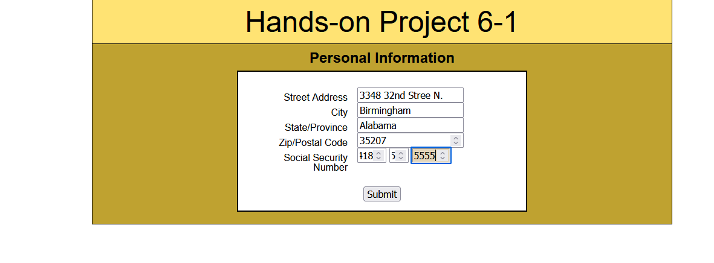

[Back to Portfolio](./)

Website Design Final Project
===============

-   **Class:** *CSCI 226 Internet Programming* 
-   **Grade:** *A* 
-   **Language(s):** *HTML & CSS* 


## Project description

This project was to build a litely functional webite which showcases student abilities to create a finish UI that incorpoated HTML, CSS, and some JavaScript in the design. The is comprised of several of the assignments and task created over the course of the semester. 

## How to run the program

How to run the project.

```bash
To view the site got to: http://rodoliver.atwebpages.com/finalproject/ROWebDesigns.htm

<!DOCTYPE html>
<html lang="en-us">
<head>
    
<script src="modernizr-2.js"></script>
<title>R.O. Web Gallery</title>    
    <!--
           Author: Roderick Oliver
           Assignment: Final Exam Project
    Problem 
           Date: 11/21/2016
       -->
   <meta charset="utf-8" />
    <style>
  

    #container {
        max-width: 95%;
        min-width: 60%;
        margin: 0 auto;
        padding:0;
        border: 4px solid black;
        border-radius: 22px;
     }
 
    header {
            padding-top: 1em;
            background-image: url(images/paisley.png);
            border-radius: 10px;
        }

    
    h1.headfontstyleh1 {
         margin: 0 auto;
         padding: 0;
         font-size: 65px;
         font-family: Copperplate / Copperplate Gothic Light, sans-serif;
         color: #356094;
         text-shadow: 0 1px 0 #999999, 0 2px 0 #888888,
             0 3px 0 #777777, 0 4px 0 #666666,
             0 5px 0 #555555, 0 6px 0 #444444,
             0 7px 0 #333333, 0 8px 7px rgba(0, 0, 0, 0.4),
             0 9px 10px rgba(0, 0, 0, 0.2);      
    }
       
    h5.headfontstylesp {
        margin: 0 auto;
        padding: 0 0 2em 10em;
        font-size: 18px;       
        font-style: oblique;
        color: #191970;
        text-shadow: 0 0 5px #356094, 0 0 5px #0094ff,
             0 0 10px #A5F1FF, 0 0 15px #A5F1FF,
             0 0 20px #A5F1FF;
       }   

    header p {
        margin: 0 auto;
        padding-bottom: 2em;
        font-weight: bold;
    }   
    
    img {
        vertical-align: top;
    }

    img.header {
            margin: 0 5em 0 1em;
            box-shadow: 6px 6px 5px 0 #888888;
            border-radius: 15px;
            float: left;
        }

    span.thumbnail {
         float:right;
         margin: 5px;
         padding-top: 10px;
        }      

    body {
        background-attachment: fixed;
        background-image: url(images/dark_wood.png);
        }

 
    #sec1 {
        padding: 0 12px 0 12px;
    }

    #sec3 {
         padding: 0 12px 0 12px;
    }

    nav ul {
                text-align: center;
    }

    nav li {
            padding-right: 12px;
        }

    nav ul li  {
            display: inline;
            text-align: center;
        }

    a {
        height: 50px;
        line-height: 50px; 
    }

    .button-link {
            padding: 10px 15px;
            background: #4479BA;
            color: white;
            text-decoration: none;
            -webkit-border-radius: 4px;
            -moz-border-radius: 4px;
            border-radius: 4px;
            border: solid 1px #20538D;
            text-shadow: 0 -1px 0 rgba(0, 0, 0, 0.4);
            -webkit-box-shadow: inset 0 1px 0 rgba(255, 255, 255, 0.4), 0 1px 1px rgba(0, 0, 0, 0.2);
            -moz-box-shadow: inset 0 1px 0 rgba(255, 255, 255, 0.4), 0 1px 1px rgba(0, 0, 0, 0.2);
            box-shadow: inset 0 1px 0 rgba(255, 255, 255, 0.4), 0 1px 1px rgba(0, 0, 0, 0.2);
            -webkit-transition-duration: 0.2s;
            -moz-transition-duration: 0.2s;
            transition-duration: 0.2s;
    }
      
    .button-link:hover, .button-link:focus {
            background: #356094;
            border: solid 1px #2A4E77;
            text-decoration: none;
    }

    .button-link:active {
            -webkit-box-shadow: inset 0 1px 4px rgba(0, 0, 0, 0.6);
            -moz-box-shadow: inset 0 1px 4px rgba(0, 0, 0, 0.6);
            box-shadow: inset 0 1px 4px rgba(0, 0, 0, 0.6);
            background: #2E5481;
            border: solid 1px #203E5F;
    }

    ul.star {
            list-style-image: url(images/star4.jpg);
            font-size: 1em;
            font-family: Bodoni MT,Didot,Didot LT STD,Hoefler Text,Garamond,Times New Roman,serif;            
            color: navy;
            line-height: 2em;
            
    }
    
    .col1 {
            margin: 0 4em 0 1.5em;
            padding: 0 5px 160px 5px;
            width: 25%;    
            border: solid 2px black;       
            background-image: url(images/paisley.png);
            border-radius: 15px;
            float: left;
    }

    .col2 {
            padding: 0 20px 220px 20px;
            width: 28%;
            border: solid 2px black; 
            background-image: url(images/paisley.png);
            border-radius: 15px;
            float: left;
    }

    .col3 {
            margin: 0 1em 0 4em;
            padding: 0 20px 0 30px;
            width:25%;
            border: solid 2px black; 
            background-image: url(images/paisley.png);
            border-radius: 15px;
            float: left;
    }

    em {
        font-size: 20px;
        color: navy;
    }

    fieldset {
            margin-right: 10px;
            padding-top: 0;
            border: solid 2px black;
            background-color: #99ccff;
            -webkit-border-radius: 4px;
            -moz-border-radius: 4px;
            border-radius: 4px;
            border: solid 1px #20538D;
            -webkit-box-shadow: inset 0 1px 0 rgba(255, 255, 255, 0.4), 0 1px 1px rgba(0, 0, 0, 0.2);
            -moz-box-shadow: inset 0 1px 0 rgba(255, 255, 255, 0.4), 0 1px 1px rgba(0, 0, 0, 0.2);
            box-shadow: inset 0 1px 0 rgba(255, 255, 255, 0.4), 0 1px 1px rgba(0, 0, 0, 0.2);
            -webkit-transition-duration: 0.2s;
            -moz-transition-duration: 0.2s;
            transition-duration: 0.2s;
    }

    legend {
            color:black;
    }

    .labelfloatleft label {
            width: 100px;
            margin-right: 15px;
            color: black;
            float: left;
            text-align: right;
    }
    .labelfloatleft input {
            display: block;
    }

       #shadow1, #shadowbutton1 {
           margin-left: 30px;
            box-shadow: 6px 6px 5px 0 #888888;      
    }

      #shadow2, #shadowbutton2 {
            margin-left: 30px;
            box-shadow: 6px 6px 5px 0 #888888;      
    }


    footer {
            max-width: 35%;
            margin: 0 auto;
            padding: 0.5em 0;
            background-image: url(images/paisley.png);
            border-top: solid 2px black;
            border-radius: 22px;
            clear: both;
            font-weight: bold;
            text-align: center;
    }
    </style>
</head>
<body>    
    <div id="container">
        <header>
            
            <h1 class="headfontstyleh1 ">R.O. Web Designs</h1> 
            <h5 class="headfontstylesp">Where we make all your dreams a reality!</h5>         
                <p>
                    Roderick Oliver - <em>Lead Web Developer</em><br />
                    Address: 300 Terilyn Court Greenville, SC<br />
                    Contact: (205) 864-329-2355
                </p>        
        </header>
    </div>
        <nav>
            <ul>
                <li><a class="button-link" href="brick/bricksolution.htm" title="Brick Solution">Welcome</a></li>
                <li><a class="button-link" href="barker/barker.htm" title="Barker Bread">Barker Bread</a></li>
                <li><a class="button-link" href="contact/gild.htm" title="Gild Shipping">Shipping and Receiving</a></li>
                <li><a class="button-link" href="power/power.htm" title="Sierra Desert">Energy</a></li>
                <li><a class="button-link" href="books/books.htm" title="Woodpendium Books">Books</a></li>
                <li><a class="button-link" href="ziller/ziller.htm" title="Ziller Financial">Finance</a></li>
                <li><a class="button-link" href="lana/lana.htm" title="Lana Bowling Lanes">Recreation</a></li>
                <li><a class="button-link" href="body/body.htm" title="Body By You">Fitness</a></li>
                <li><a class="button-link" href="award/awardballot.htm" title="WKZ Hollywood">Entertainment</a></li>
            </ul>
        </nav>
   
    <div>
      
        <section class="col1" id="sec1">
            <h2>About R.O. Web Designs</h2>
            <p>
                Though R.O. Web Designs is not a real company, this Web page was created for a class project as a skill assessment. The site provided
                was created to consist of all skills learned throughout the course, and is to contain functioning links, thumbnails, and other features in a three column liquid layout.
                So, with that being said; here at R.O. Web Designs we provide our customers with the highest quality in professional web designs. 
                Included in our promise to offer a product that is second to none, we supply our customers with the optoion 
                to choose from several different services and maintenance packages. Our customers can trust that we will develop cutting edge, responsive sites, that are guaranteed to increase their 
                SEO (Seach Engine Optimization) and yield an increase in visits to their sites. Below is a list of some of the previous
                business models we've had the pleasure to work with in the past.             
            </p>

            <ul class="star">
                <li>Shipping and Receiving</li>
                <li>Recreation and Entertainment</li>
                <li>Fitness and Health</li>
                <li>Energy</li>
                <li>And much more...</li>
            </ul><br />            
            </section>
        </div>

    <div>
        <section class="col2">
            <h2>Our Work Speaks for Itself</h2>
            <p>
                Among many of the sites and pages we have designed for our customers, we feel that it is important to let potential customers
                judge for themselves. Though many Web designers showcase their services by providing simple design examples, we take it a step further and give the
                customers the ability to perform live interactions right here in our portfolio site. Customers are able to interact with our site
                by using many of the buttons, links, thumbnails,<span class="thumbnail"><a href="art/art3col.htm" title="Ink Wash Art Gallery"></a></span><br />
                and other features. We encourage you to began navigating the site by starting with clicking the thumb nail to the right; or just by clicking any of the button links
                above. There you will find sites we've created for other customers with a diversity of formats. Here at R.O. Web Designs we truly believe that we can be the Web developers you are looking for,
                and hope that you will consider us for your web site needs.
            </p>
        </section>
   </div>

    <div id="wrapper">
        <section class="col3" id="sec3">
            <h2>If You're Interested in Our Services</h2>
            <p>
                Hopefully you have navigated our site and have discovered that we are the developers of your choice. If you have not looked around our site, we encourage you to
                to do so at this time. But, if you have, and you are interested in setting up a meeting with us and just need more information, please submit your contact information in the form below
                and one of our representives will reach out to you on the next following business day. Once again, thank you for visiting our site and for considering our services. We hope to be doing business with you soon. And remember,
                R.O. Web Designs is,<em>"Where we make all your dreams a reality!"</em>
            </p>

            <div>
                <!-- enter the form code below -->
                <form id="survey" name="survey" method="post" action="javascript:submitform();">
                    <fieldset id="shadow1" class="labelfloatleft">
                        <legend>Contact Information</legend>
                        <label for="firstname">First Name</label>
                        <input class="text" type="text" name="firstname" id="firstname" placeholder="first name" />

                        <label for="lastname">Last Name</label>
                        <input class="text" type="text" name="lastname" id="lastname" placeholder="last name" />

                        <label for="emailaddress">Email Address</label>
                        <input class="text" type="email" name="emailaddress" id="emailaddress" placeholder="name@anywhere.com" />
                    </fieldset><br />

                    <fieldset id="shadow2">
                        <legend>I am interested: (check option below)</legend>
                        <fieldset>
                            <input type="checkbox" name="interested" id="information" value="websites" />
                            <label for="information">I'd like to receive additional information about upcoming events and seminars and would like to schedule an appointment.</label>
                        </fieldset>
                    </fieldset><br />

                    <input id="shadowbutton1" type="submit" value="Send Information" class="button-link" />
                    <input id="shadowbutton2" type="reset" value="Reset" class="button-link" />
                </form>

            </div><br /> <!-- end formcontainer -->
        </section> <!--end main setion -->
   </div>
    <div>
        <footer>
            <p>
                Greenville Technical Community College<br />
                Date Created: November 23, 2016 <br />&bull; Course Number: IST-226 Internet Programming<br />

            </p>
        </footer>
    </div>
</body>
</html>

```

Site code with Javavscript enhancements and additonal projects.

```bash
<!DOCTYPE html>
<html lang="en-us">
<head>
    
<script src="modernizr-2.js"></script>
<title>R.O. Web Gallery</title>    
    <!--
           Author: Roderick Oliver
           Assignment: Final Exam Project
    Problem 
           Date: 4/19/2017
       -->
   <meta charset="utf-8" />
<style>
  

#container {
        max-width: 100%;
        min-width: 65%;
        margin: 0 auto;
        padding:0;
        border-radius: 22px;
     }
 
header {
            padding-top: 2em;
            background-image: url(images/patterns_075.jpg);
            border-bottom: solid #191970;
        }

    
h1.headfontstyleh1 {
         margin: 0 auto;
         padding-bottom: 2px;
         font-size: 65px;
         font-family: Copperplate,Copperplate Gothic Light,fantasy;
	     font-style: normal;
	     font-variant: normal;
	     font-weight: 500;
	     line-height: 26.4px;
         color: #191970;
         text-shadow: 0 1px 0 #999999, 0 1px 0 #888888,
             0 2px 0 #777777, 0 3px 0 #666666,
             0 4px 0 #555555, 0 5px 0 #444444,
             0 6px 0 #333333, 0 7px 6px rgba(0, 0, 0, 0.4),
             0 8px 9px rgba(0, 0, 0, 0.2);      
    }

h2.headfontstyleh2 {
        font-family: Papyrus, fantasy;
        font-weight: bold;
        color: #191970;
}
       
h5.headfontstylesp {
        margin: 0 auto;
        padding: 1em 0 2em 10em;
        font-size: 18px;       
        font-family: Papyrus,fantasy;
        color: #191970;
        text-shadow: 0 0 5px #356094, 0 0 5px #0094ff,
             0 0 10px #A5F1FF, 0 0 15px #A5F1FF,
             0 0 20px #A5F1FF;
       }   

header p {
        margin: 0 auto;
        padding-bottom: 2em;
        font-family: "Lucida Bright", Georgia, serif;
        color:black;
        font-weight: bold;
    }   
    
img {
        vertical-align: top;
    }

img.header {
            margin: -1em 3em 1em 3em;
            width: 145px;
            height: 185px;
            box-shadow: 6px 6px 5px 0 black;
            border-radius: 15px;
            float: left;
        }

span.thumbnail {
         float:right;
         margin: 5px;
         padding-top: 10px;
        }      

html, body {
        margin: 0;
        padding: 0;
        max-width: 100%;
        min-width:65%;
        background-attachment: fixed;
        background-image: url(images/pencils2_075.jpg);
        
        }

p {
        color: black;
        font-size: medium;
    }

 
#sec1 {
        padding: 0 12px 0 12px;
    }

#sec3 {
         padding: 0 12px 0 12px;
    }

nav {
    margin: auto;
    padding: 0 0 0 85px;
    width: 100%;
    display: block;
    position:absolute;
}


 .dropbtn {
   -moz-box-shadow:inset 0px 1px 0px 0px #54a3f7;
	-webkit-box-shadow:inset 0px 1px 0px 0px #54a3f7;
	box-shadow:inset 0px 1px 0px 0px #54a3f7;
	background:-webkit-gradient(linear, left top, left bottom, color-stop(0.05, #007dc1), color-stop(1, #0061a7));
	background:-moz-linear-gradient(top, #007dc1 5%, #0061a7 100%);
	background:-webkit-linear-gradient(top, #007dc1 5%, #0061a7 100%);
	background:-o-linear-gradient(top, #007dc1 5%, #0061a7 100%);
	background:-ms-linear-gradient(top, #007dc1 5%, #0061a7 100%);
	background:linear-gradient(to bottom, #007dc1 5%, #0061a7 100%);
	background-color:#007dc1;
	-moz-border-radius:3px;
	-webkit-border-radius:3px;
	border-radius:0px 3px 3px 3px;
	border:1px solid #124d77;
	cursor:pointer;
	color:#ffffff;
	font-family:'Arial Rounded MT';
	font-size:13px;
 margin: 0 1px 0 1px;;
	padding:8px 18px;
	text-decoration:none;
	text-shadow:0px 1px 0px #154682;
}

.dropbtn:hover, .dropbtn:focus {
    background-color: #3e8e41;
}


.dropdown {
    float:left;
}

.dropdown-content {
    display: none;
    position: absolute;
    background-color: #f9f9f9;
    min-width: 160px;
    overflow: auto;
    box-shadow: 0px 8px 16px 0px rgba(0,0,0,0.2);
    z-index: 1;   
}


.counter a {
    display: block;
    position: relative;
    padding: 8px;
    text-decoration: none;
    background-color: white;
    color: #154682;
    border-bottom: 1px solid #e6e8ea;
    box-shadow: inset 0 1px 0 rgba(255,255,255,1);
    transition: all 0.3s ease-out;

}

.dropdown a:hover {
    background-color: #d4d4cb;
}

.show {display:block;}

    .col1 {
            margin: 7.9em 4em 20em 1.7em;
            padding: 0 5px 160px 5px;
            width: 25%;    
            border: solid 2px black;       
            background: rgba(255,255,255,.5);
            border-radius: 15px;
            float: left;
    }

    .col2 {
            margin-top: 8em;
            margin-bottom: 20em;
            padding: 0 20px 20px 20px;
            width: 28%;
            border: solid 2px black; 
            background: rgba(255,255,255,.5);
            border-radius: 15px;
            float: left;
    }

    .col3 {
            margin: 8em 1em 20em 4em;
            padding: 0 20px 0 30px;
            width:25%;
            border: solid 2px black; 
            background: rgba(255,255,255,.5);
            border-radius: 15px;
            float: left;
    }

@keyframes fadeIn {
  to {
    opacity: 1;
  }
}

.fade-in {
  opacity: 0;
  animation: fadeIn 1.8s ease-in 1 forwards;
}

.fade-in2 {
  opacity: 0;
  animation: fadeIn 2.3s ease-in 1 forwards;
}

.fade-in3 {
  opacity: 0;
  animation: fadeIn 2.8s ease-in 1 forwards;
}

.fade-in4 {
  opacity: 0;
  animation: fadeIn 1.2s ease-in 1 forwards;
}
.is-paused {
  animation-play-state: paused;
}

    em {
        font-size: 20px;
        color: navy;
    }

    fieldset {
            margin-right: 10px;
            padding-top: 0;
            border: solid 2px black;
            background-color: #99ccff;
            -webkit-border-radius: 4px;
            -moz-border-radius: 4px;
            border-radius: 4px;
            border: solid 1px #20538D;
            -webkit-box-shadow: inset 0 1px 0 rgba(255, 255, 255, 0.4), 0 1px 1px rgba(0, 0, 0, 0.2);
            -moz-box-shadow: inset 0 1px 0 rgba(255, 255, 255, 0.4), 0 1px 1px rgba(0, 0, 0, 0.2);
            box-shadow: inset 0 1px 0 rgba(255, 255, 255, 0.4), 0 1px 1px rgba(0, 0, 0, 0.2);
            -webkit-transition-duration: 0.2s;
            -moz-transition-duration: 0.2s;
            transition-duration: 0.2s;
    }

    legend {
            color:black;
    }

    .labelfloatleft label {
            width: 100px;
            margin-right: 15px;
            color: black;
            float: left;
            text-align: right;
    }
    .labelfloatleft input {
            display: block;
    }
    
    .form-style-9{
    max-width: 450px;
    background: rgba(255,255,255,.5);
    padding: 30px;
    margin: 50px auto;
    box-shadow: 1px 1px 25px rgba(0, 0, 0, 0.35);
    border-radius: 10px;
    border: 2px solid #305A72;
}
.form-style-9 ul{
    padding:0;
    margin:0;
    list-style:none;
}
.form-style-9 ul li{
    display: block;
    margin-bottom: 10px;
    min-height: 35px;
}
.form-style-9 ul li  .field-style{
    box-sizing: border-box; 
    -webkit-box-sizing: border-box;
    -moz-box-sizing: border-box; 
    padding: 8px;
    outline: none;
    border: 1px solid #B0CFE0;
    -webkit-transition: all 0.30s ease-in-out;
    -moz-transition: all 0.30s ease-in-out;
    -ms-transition: all 0.30s ease-in-out;
    -o-transition: all 0.30s ease-in-out;

}.form-style-9 ul li  .field-style:focus{
    box-shadow: 0 0 5px #B0CFE0;
    border:1px solid #B0CFE0;
}
.form-style-9 ul li .field-split{
    width: 49%;
}
.form-style-9 ul li .field-full{
    width: 100%;
}
.form-style-9 ul li input.align-left{
    float:left;
}
.form-style-9 ul li input.align-right{
    float:right;
}

.form-style-9 ul li input[type="button"], 
.form-style-9 ul li input[type="submit"],
.form-style-9 ul li input[type="reset"]{
    -moz-box-shadow: inset 0px 1px 0px 0px #3985B1;
    -webkit-box-shadow: inset 0px 1px 0px 0px #3985B1;
    box-shadow: inset 0px 1px 0px 0px #3985B1;
    background-color: #216288;
    border: 1px solid #17445E;
    display: inline-block;
    cursor: pointer;
    color: #FFFFFF;
    padding: 8px 18px;
    text-decoration: none;
    font: 12px Arial, Helvetica, sans-serif;
}
.form-style-9 ul li input[type="button"]:hover, 
.form-style-9 ul li input[type="submit"]:hover,
.form-style-9 ul li input[type="submit"]:hover {
    background: linear-gradient(to bottom, #2D77A2 5%, #337DA8 100%);
    background-color: #28739E;
}

       #shadow1, #shadowbutton1 {
           margin-left: 10px;
            box-shadow: 6px 6px 5px 0 #888888;      
    }

      #shadow2, #shadowbutton2 {
            margin-left: 30px;
            box-shadow: 6px 6px 5px 0 #888888;      
    }


    footer {
            max-width: 100%;
            margin: 0 auto;
            padding: 0.5em 0;
            background-image: url(images/patterns.jpg);
            border-top: solid #191970;
            font-family: Copperplate,Copperplate Gothic Light,fantasy;
            clear: both;
            font-weight: bold;
            text-align: center;
    }
</style>
</head>
<body>    
    <div id="container">
        <header>
            
            <h1 class="headfontstyleh1 "><span class='js-fade fade-in4'>R.O.</span> <span class='js-fade fade-in2'>Web</span> <span class='js-fade fade-in3'>Designs</span></h1> 
            <h5 class="headfontstylesp">Where we make all your dreams a reality!</h5>         
                <p>
                    Roderick Oliver - <em>Lead Web Developer</em><br />
                    Address: 300 Terilyn Court Greenville, SC<br />
                    Contact: (864) 329-2355
                </p>        
        </header>
   
          <nav>
            <div class="dropdown">
                <button onclick="dropDownList(1)" class="dropbtn">Project 01</button>
                <div id="myDropdown1" class="dropdown-content counter">
                    <a href="project1_1">Financial Planning</a>
                    <a href="project1_3">Order Form</a>
                    <a href="project1_5">Holiday Closure</a>
                </div>  
            </div>
            <div class="dropdown">
                <button onclick="dropDownList(2)" class="dropbtn">Project 02</button>
                <div id="myDropdown2" class="dropdown-content counter">
                    <a href="project2_1">Degrees Converter</a>
                    <a href="project2_3">Pick A Shape</a>
                    <a href="project2_5">Lunch Selections</a>
                </div>
            </div>
            <div class="dropdown">
                <button onclick="dropDownList(3)" class="dropbtn">Project 03</button>
                <div id="myDropdown3" class="dropdown-content counter">
                    <a href="project3_1">Lunch Selections</a>
                    <a href="project3_3">Scouting Locations</a>
                    <a href="project3_5">Adding Tools</a>
                </div>
            </div>
            <div class="dropdown">
                <button onclick="dropDownList(4)" class="dropbtn">Project 04</button>
                <div id="myDropdown4" class="dropdown-content counter">
                    <a href="project4_1/tractor.htm">Tuba Farm Equipment</a>
                    <a href="project4_3">Adding Places</a>
                    <a href="project4_5">Miles Converter</a>
                </div>
            </div>
            <div class="dropdown">
                <button onclick="dropDownList(5)" class="dropbtn">Project 05</button>
                <div id="myDropdown5" class="dropdown-content counter">
                    <a href="project5_1">Browser Info</a>
                    <a href="project5_3">Address Change Form</a>
                </div>
            </div>
            <div class="dropdown">
                <button onclick="dropDownList(6)" class="dropbtn">Project 06</button>
                <div id="myDropdown6" class="dropdown-content counter">
                    <a href="project6_1">Personal Info. 1</a>
                    <a href="project6_3">Personal Info. 2</a>
                    <a href="project6_5">Pizza Order Form</a>
                </div>
            </div>
            <div class="dropdown">
                <button onclick="dropDownList(7)" class="dropbtn">Project 07</button>
                <div id="myDropdown7" class="dropdown-content counter">
                    <a href="project7_1">Square Root Calculator</a>
                    <a href="project7_3">Luch Selections</a>
                    <a href="project7_5">Pizza Order Form</a>
                </div>
            </div>
            <div class="dropdown">
                <button onclick="dropDownList(8)" class="dropbtn">Project 08</button>
                <div id="myDropdown8" class="dropdown-content counter">
                    <a href="project8_1">Account Info</a>
                    <a href="project8_3">Payment Info</a>
                    <a href="project8_5">To Do List</a>
                </div>
            </div>
            <div class="dropdown">
                <button onclick="dropDownList(9)" class="dropbtn">Project 09</button>
                <div id="myDropdown9" class="dropdown-content counter">
                    <a href="project9_1">Greeting Card Creator</a>
                    <a href="project9_3">Site Login 1</a>
                    <a href="project9_5">Site Login 2</a>
                </div>
            </div>
            <div class="dropdown">
                <button onclick="dropDownList(10)" class="dropbtn">Project 10</button>
                <div id="myDropdown10" class="dropdown-content counter">
                    <a href="project_10_1">Picture Puzzle</a>
                </div>
            </div>
            <div class="dropdown">
                <button onclick="dropDownList(11)" class="dropbtn">Project 11</button>
                <div id="myDropdown11" class="dropdown-content counter">
                    <a href="project_11_4/address.htm">Address Lookup 1</a>
                    <a href="project_11_5/address.htm">Adress Lookup 2</a>
                </div>
            </div>
        </nav>   
      
        <section class="col1" id="sec1">
            <h2 class="headfontstyleh2">About R.O. Web Designs</h2>
            <p class='js-fade fade-in'>
                Though R.O. Web Designs is not a real company, this Web page was created for a class project as a skill assessment. The site provided
                was created to consist of all skills learned throughout the course, and is to contain functioning links, thumbnails, and other features in a three column liquid layout
                with some embedded JavaScript to help with demonstrationg a commitment to providing a website with a greater user experience.
                So, with that being said; here at R.O. Web Designs we provide our customers with the highest quality in professional web designs.
                Included in our promise to offer a product that is second to none, we supply our customers with the option
                to choose from several different services and maintenance packages. Our customers can trust that we will develop cutting edge, responsive sites, that are guaranteed to increase their
                SEO (Seach Engine Optimization) and yield an increase in visits to their sites. With the persistent demand for websites to yield greater user experiences, our company continue to worked with
                many clients to provide exceptional interfaces to meet all their required needs. 
            </p>
            </section>
        </div>

        <div>
          <section class="col2">
            <h2 class="headfontstyleh2">Our Work Speaks for Itself</h2>
            <p class='js-fade fade-in2'>
                Among many of the sites and pages we have designed for our customers, we feel that it is important to let potential customers
                judge for themselves. Though many Web designers showcase their services by providing simple design examples, we take it a step further and give the
                customers the ability to perform live interactions right here in our portfolio site. Customers are able to interact with our site
                by using many of the buttons, links, thumbnails,<span onclick="openPage()" class="thumbnail"><a href="" title="Fan Trick Fine Art Photography"></a></span><br />
                and other features. We encourage you to began navigating the site by starting with clicking the thumb nail to the right; or just by clicking any of the button links
                above, or by testing out some of the features added to our submit form. Here you will find several applications and sites we've created for other customers with a diversity of formats. Here at R.O. Web Designs we truly believe that we can be the Web developers you are looking for,
                and hope that you will consider us for your web site and application needs.
            </p>
          </section>
     </div>

     <div id="wrapper">
        <section class="col3" id="sec3">
            <h2 class="headfontstyleh2">If You're Interested in Our Services</h2>
            <p class='js-fade fade-in3'>
                Hopefully you have navigated our site and have discovered that we are the developers of your choice. If you have not looked around our site, we encourage you to
                to do so at this time. But, if you have, and you are interested in setting up a meeting with us and just need more information, please submit your contact information in the form below
                and one of our representives will reach out to you on the next following business day. Once again, thank you for visiting our site and for considering our services. We hope to be doing business with you soon. And remember,
                R.O. Web Designs is, <em>"Where we make all your dreams a reality!"</em>
            </p>
            <div id="errorText">
                
                <form class="form-style-9" id="survey" name="survey" method="post" action="javascript:submitform();">
                    <ul>
                      <li>
                        <input type="text" name="firstlastname" id="firstlastname" class="field-style field-split align-left" placeholder="Full Name" required/>
                        <input type="email" name="emaiaddress" id="emailaddress" class="field-style field-split align-right" placeholder="Email" required/>
                     </li>
                     <li>
                        <input type="text" name="phone" id="phone" class="field-style field-split align-left" placeholder="Phone" />
                     </li>
                     <li>
                        <input onclick="checkBoxChecked();" type="checkbox" name="interested" id="information" value="websites" />
                        <label for="information">I'd like to receive additional information about upcoming events and seminars and would like to schedule an appointment.</label>
                     </li>
                     <li>
                        <input id="shadowbutton1" type="submit" value="Send Information" class="button-link" />
                        <input id="shadowbutton2" type="reset" value="Reset" class="button-link" />
                      </li>

                   </ul>
               </form>

            </div><br /> <!-- end formcontainer -->

          
        </section> <!--end main setion -->
    </div>
    <div>
        <footer>
            <p>
                Greenville Technical Community College<br />
                Date Created: April 19, 2017 <br />&bull; Course Number: CPT-239 JavaScript<br />

            </p>
        </footer>
    </div>
    
    <script>
    
      function fadeIn() {
        var fadeEl = document.querySelector('.js-fade');
        if (fadeEl.classList.contains('is-paused')) {
            fadeEl.classList.remove('is-paused');
        }
      }     

      function dropDownList(dropDownRef) {

            var myElements = document.getElementsByClassName("counter").length;

            for (i = 1; i <= myElements; i++) {
                document.getElementById("myDropdown" + i).classList.add("dropdown-content");
            }
            document.getElementById("myDropdown" + dropDownRef).classList.toggle("dropdown-content");
      }

          
      function openPage() {
              var fineArt = window.open("chapter1/estimate.htm");
              
       } 
       
      function checkBoxChecked() {
            var input = document.getElementById("information");
            var isChecked = input.checked;
            isChecked = (isChecked) ? "receive additional information and will be added to our monthly newsletter." : "not to receive any additional information. Did you mean to choose this option?";
            alert("You have chosen to " + isChecked);
      }

      function submitInfo() {
            var name = document.getElementById("firstlastname");
            var email = document.getElementById("emailaddress");
           
            (name.value && email.value) ? alert("Thank you for your submission!") : alert("Please fill in all fields");
      }
        document.getElementById("shadowbutton1").addEventListener("click", submitInfo, false);
        

        // Close the dropdown if the user clicks outside of it
        window.onclick = function (event) {
            if (!event.target.matches('.dropbtn')) {

                var dropdowns = document.getElementById("dropdown-content");
                var i;
                for (i = 0; i < dropdowns.length; i++) {
                    var openDropdown = dropdowns[i];
                    if (openDropdown.classList.contains('show')) {
                        openDropdown.classList.remove('show');
                    }
                }
            }
        }
             
        if (window.addEventListener) {
                window.addEventListener("load", fadeIn, false);
        } else if (window.attachEvent) { 
                window.attachEvent("onload", fadeIn);
            }
    </script>
</body>
</html>

```

The application doesn't need compiliing but can be run by going tothe webpages link above. To be able to recreate the assignment you would need to go to https://webfreehosting.net/login.php to create an account for a free domain. Fron the domain you will be able to add all the file to the domain to be able display them online. This process is similar to adding the application on a webserver. For instructions please feel free to contact me.

## UI Design

The application is just a simple desgin that allow the user to view basic function on how a website works. This site allows for the user to use buttons, checkboxes, clickable thumbnails, and radio buttons to understand how the website respond to user interaction.

Website landing page on load (see Fig 1), displays the user interface with interactive links for the user to be able to navigate the site, and see how the clickable items and links respond. The Recreation pages just to display code style and design, as well as to showcase the use of a different nav bars style (see Fig 2).The Entertainment page showcases the use of a radio button style form that allows a user to make a selection for movie tickets with the ability to reset the form for the user (see Fig 3). The Fitness site showcases the use of tables and rows within a website. The site also showcases the styling that is used for alternating colors on rows (see Fig 4). In order to enhance the site, the use of Javasripte was used from my CSCI 239 *DHTML and JavaScript* class. (see Fig 5 -9) The last few figures are projects created in the class compiled into a web portfolio at the end of the semester. To see the details of the sites in action launch them by clicking the links below:  
<a href="http://rodoliver.atwebpages.com/finalproject/ROWebDesigns.htm">R.O. Web Design Final Project</a>  
<a href="http://rodoliver.atwebpages.com/portfolio/projects/RODesigns.htm">R.O. Web Gallery</a>


Fig 1. The Landing Page


Fig 2. Site load after clicking the Recreation button on the nav bar.


Fig 3. Site load after clicking the Entertainment button on the nav bar.


Fig 4. Site load after clicking the Fitness button on the nav bar.



Fig 5. Example a hands on project that uses Javascript for filling in form data.


Fig 6. Example the submitted form and the results.


Fig 7. Example a hands on project for looking up a zipcode location.


Fig 8. Example the JavaScript auto fill for the form.


Fig 9. Example the address lookup completed with city and state.

## 3. Additional Considerations

As a result of what I have learned over the years, I have continued to work towards building my skillset through continual development and training by learning applications such as *Power Query & Power BI, MySQL, etc.*). Below is an example of a example site I started working on in 2017 for an automotive maintenance site based on a class project using PHP. The page is only the login page and the code for the vehicle logs can be shared if requested.


For more details see [Personal Project UI](personal_project).

[Back to Portfolio](./)
